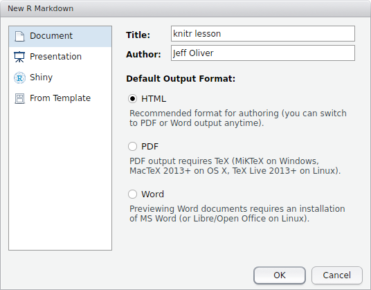

An introduction to using the `knitr` package in R to produce reproducible, dynamic reports.

#### Learning objectives
1. Install and use third-party packages for R
2. Become familar with R Markdown syntax
3. Write dynamic reports including code and visualizations

## Literate programming
What if there was a way to include text _and_ all the code we used for our analyses in a single document? What about a report that includes not only data visualization, but the actual code used to produce those visualizations? With literate programming, we write text and code in a single document - this way, we can update reports and manuscripts with new data or corrections with minimal effort.

***

## Getting started
To create these reports, we will make heavy use of the `knitr` package for R. So if you have not already installed it, run this command in your R console:

```{r eval = FALSE}
install.packages("knitr")
```

To make these reports, which are ultimately output in HTML, PDF, or Word format, we use a text format called R Markdown. The concept is to use pure text to indicate formatting like **bold**, _italics_, and ^superscripts^, and to combine this formatting with code that can be executed and output displayed. More on how we do that later. For now, let's start by creating a new R Markdown file via File > New File > R Markdown... You should then be prompted with a window like:



<br />
For the title, enter "knitr lesson" and add your name to the author field. Leave the default output format as HTML.

At the top of the file is the header section, which includes basic information about your document. The only field that is absolutely required is the `output` field, but it is best to include the title, author, and date information, too. Note that immediately below this header is a chunk of code:

<pre>
&#96;&#96;&#96;{r setup, include=FALSE}
knitr::opts_chunk$set(echo = TRUE)
&#96;&#96;&#96;
</pre>

Followed by text:

```
## R Markdown

This is an R Markdown document. Markdown is a simple formatting syntax for authoring HTML, 
PDF, and MS Word documents. For more details on using R Markdown see <http://rmarkdown.rstudio.com>.
```

We will start with formatting in R Markdown syntax, followed by how to include R code in your document.

## R Markdown

To try out these formatting examples, start by deleting everything after the header section, so your document only includes:

```
---
title: "Knitr lesson"
author: "Jeff Oliver"
date: "April 27, 2017"
output: html_document
---
```

Below the header, add this text to your file:

```
# Introduction to knitr

This is my first knitr document.

Bulleted lists

+ Regular font
+ **bold font**
+ _italic font_

Numbered lists

1. one
2. two
2. three

```

And the output file is created when we press the **Knit** button in the top-left part of the screen (or by pressing Shift-Ctrl-K):

> # Knitr lesson
> #### _Jeff Oliver_
> #### _April 27, 2017_
> 
> # Introduction to knitr
> 
> This is my first knitr document.
> 
> Bulleted lists
> 
> + Regular font
> + **bold font**
> + _italic font_
> 
> Numbered lists
> 
> 1. one
> 2. two
> 2. three

Notice the large font of "Introduction to knitr". Because we used a single pound sign (#) at the start of the line, this text is formated as a level 1 header. To format lower headers, we add pound signs:

```
# header 1
## header 2
### header 3
#### header 4
```
Which are rendered as:

> # header 1
## header 2
### header 3
#### header 4

We can also add hyperlinks to our document, using this syntax: `[text we want to link](url address)`. So to create a link to the University of Arizona homepage, we write `[University of Arizona](http://www.arizona.edu)`. When we run Knit, this is displayed in our document as [University of Arizona](http://www.arizona.edu).

Images are also supported, whether they are local files or images on the web. The syntax is almost identical to that for hyperlinks, but in the case of images, we prefix the statement with an exclamation point (!): ``

Here I use an image from [Wikimedia](https://commons.wikimedia.org) and include a caption:
```

```

> 

Subscripts and superscripts are also supported by wrapping the font in tildes (~) and carets (^), respectively:
```
Subscript: log~10~
Superscript: r^2^
```

> Subscript: log~10~
> Superscript: r^2^

Now what happened there? Why aren't those two on separate lines? When the R Markdown file is interpreted, it assumes adjascent lines should all be part of the same paragraph, unless you indicate otherwise. The way we do this is by adding two blank spaces at the end of a line to indicate a paragraph break:
```
Subscript: log~10~  <!-- Two spaces at end of line -->
Superscript: r^2^
```
> Subscript: log~10~  
> Superscript: r^2^

And the last thing to mention about formatting is that if you want to include equations, you can use [LaTeX](http://www.latex-project.org/) syntax, surrounded by dollar signs (\$). Use single dollar signs for in-line equations, `$E = mc^2$` is rendered as $E = mc^2$. Equations in double dollar signs are displayed on their own line, so `$$E = mc^2$$` shows up as $$E = mc^2$$

You can also write more complex equations, too (remembering to bracket your LaTeX code with double dollar signs):

```
$$
\begin{aligned}
\begin{array}{l}
\displaystyle \int 1 = x + C\\
\displaystyle \int x = \frac{x^2}{2} + C \\
\displaystyle \int x^2 = \frac{x^3}{3} + C
\end{array}
\end{aligned}
$$
```

$$
\begin{aligned}
\begin{array}{l}
\displaystyle \int 1 = x + C\\
\displaystyle \int x = \frac{x^2}{2} + C \\
\displaystyle \int x^2 = \frac{x^3}{3} + C
\end{array} 
\end{aligned}
$$

***

## What about code?
The best part of knitr is the ability to include code and the output of that code. Let's start by making a new R Markdown file via `File > New File > R Markdown...` and give it the title "Iris shape analyses".
```
---
title: "Iris shape analyses"
author: "Jeff Oliver"
date: "April 27, 2017"
output: html_document
---
```

Start with a brief description of what this report is about:
```
## Introduction
In this report we test for a relationship between different parts of morphology in _Iris_ flowers.
```

> ## Introduction
> In this report we test for a relationship between different parts of morphology in _Iris_ flowers.  

Next we can add information about the data we will be using; in this case it is the built-in `iris` dataset. Add this to your R Markdown file:
```
## Materials & methods
Analyses are based on built-in data for three _Iris_ species. We used linear regression to 
test for relationships.
```

> ## Materials & methods
> Analyses are based on built-in data for three _Iris_ species. We used linear regression to test for relationships.  

Now let's actually do some R. We start by plotting the relationship between petal width and petal length. To write an R code block, we use triple-backticks (`` ``` ``) and braces to indicate the language (R in our case, but other languages such as python and bash can also be supported). Here we add code to indicate the start of the Results section, as well as a plot of the two variables:

    ## Results
    
    ```{r}`r ''`
    plot(x = iris$Petal.Length, 
        y = iris$Petal.Width,
        xlab = "Petal length (cm)",
        ylab = "Petal width (cm)")
    ```

<!-- An alternative approach to get backticks to show up in pdf and html formats
````
## Results

```{r}`r ''`
plot(x = iris$Petal.Length, 
    y = iris$Petal.Width,
    xlab = "Petal length (cm)",
    ylab = "Petal width (cm)")
```
````
-->

When we knit our document, the above code is rendered as:  

> ## Results
```{r}
plot(x = iris$Petal.Length, 
     y = iris$Petal.Width,
     xlab = "Petal length (cm)",
     ylab = "Petal width (cm)")
```

***

We can also do analyses, and reference the output with in-line code. For this example, let's find the correlation coefficient (r^2^) for the relationship between petal width and petal length. We can then reference this in the text of our report.

The R code for a linear model is:

```{r echo = FALSE}
iris.model <- lm(Petal.Width ~ Petal.Length, data = iris)
iris.model.summary <- summary(iris.model)
r.squared <- iris.model.summary$r.squared
```

    ```{r echo = FALSE}`r ''`
    iris.model <- lm(Petal.Width ~ Petal.Length, data = iris)
    iris.model.summary <- summary(iris.model)
    r.squared <- iris.model.summary$r.squared
    ```

Note for this purpose, we added the qualifier `echo = FALSE` which tells knitr _not_ to include the actual code in the output. Even though the code runs, and because this code produces no output, we won't really see any changes to our document. Save and Knit the document to see this for yourself.

You can also control code chunks in a number of other ways:

+ `eval = FALSE` to show code but not to execute it
+ `results = "hide"` to suppress any results from being included in output
+ `warning = FALSE` and `message = FALSE` to suppress warnings and messages, respectively, from being shown

Even though we set `echo = FALSE`, the code is still executed and we can reference products of that code through in-line code chunks. In this case, we want to reference the value stored in our `r.squared` variable in our document text. We use in-line code to do so. In-line code is wrapped in single backticks (`) and we skip the braces, as opposed to triple backticks and braces we used for separate code blocks. So we add this to our Results section:

```
Petal width and petal length were highly correlated (r^2^ = `r '\x60r r.squared\x60'`).
```
> Petal width and petal length were highly correlated (r^2^ = `r r.squared`).  

Hmmm...maybe we don't need r^2^ to seven digits, so update the code to only include two digits (using R's `round` function):

```
Petal width and petal length were highly correlated (r^2^ = `r '\x60r round(r.squared, 2)\x60'`).
```
> Petal width and petal length were highly correlated (r^2^ = `r round(r.squared, 2)`).  

Let's add one more thing to this report. Since these data were the same ones that R.A. Fisher used when developing statistical theory, let's provide a link to the Wikipedia page on R.A. Fisher. So go back to the Materials & Methods section and update it with a link:

Change:
```
Analyses are based on built-in data for three _Iris_ species. We used linear regression to 
test for relationships.
```
To:
```
Analyses are based on data for three _Iris_ species from the work of 
[R.A. Fisher](https://en.wikipedia.org/wiki/Ronald_Fisher). We used linear regression to 
test for relationships.
```
And the markdown for the Materials & methods sections will be rendered as:

> ## Materials & methods
> Analyses are based on data for three _Iris_ species from the work of [R.A. Fisher](https://en.wikipedia.org/wiki/Ronald_Fisher). We used linear regression to test for relationships.

Our R Markdown file should look like this:

````
    ---
    title: "Iris shape analyses"
    author: "Jeff Oliver"
    date: "April 27, 2017"
    output: html_document
    ---
    
    ## Introduction
    In this report we test for a relationship between different parts of morphology 
    in _Iris_ flowers.

    ## Materials & methods
    Analyses are based on data for three _Iris_ species from the work of 
    [R.A. Fisher](https://en.wikipedia.org/wiki/Ronald_Fisher). We used 
    linear regression to test for relationships.

    ## Results

    ```{r}`r ''`
    plot(x = iris$Petal.Length, 
        y = iris$Petal.Width,
        xlab = "Petal length (cm)",
        ylab = "Petal width (cm)")
    ```

    ```{r echo = FALSE}`r ''`
    iris.model <- lm(Petal.Width ~ Petal.Length, data = iris)
    iris.model.summary <- summary(iris.model)
    r.squared <- iris.model.summary$r.squared
    ```
    
    Petal width and petal length were highly correlated (r^2^ = `r '\x60r round(r.squared, 2)\x60'`).

````
  
***
Which produces the following, albeit short, report:

> # Iris shape analyses
> #### _Jeff Oliver_
> #### _April 27, 2017_
> 
> ## Introduction
> In this report we test for a relationship between different parts of morphology in _Iris_ flowers.  
> 
> ## Materials & methods
> Analyses are based on data for three _Iris_ species from the work of [R.A. Fisher](https://en.wikipedia.org/wiki/Ronald_Fisher). We used linear regression to test for relationships.
> 
## Results
>```{r}
plot(x = iris$Petal.Length, 
     y = iris$Petal.Width,
     xlab = "Petal length (cm)",
     ylab = "Petal width (cm)")
```
> 
> ```{r echo = FALSE}
iris.model <- lm(Petal.Width ~ Petal.Length, data = iris)
iris.model.summary <- summary(iris.model)
r.squared <- iris.model.summary$r.squared
```
> 
> Petal width and petal length were highly correlated (r^2^ = `r round(r.squared, 2)`).

There is a lot more one can do with R Markdown. Check out the [additional resources](#additional-resources) listed below for more information.

***

## Other formats
These HTML reports are great (as a matter of fact, all these lessons are written in R Markdown and converted to HTML with the `knitr` package), but what about other formats? The other two commonly used formats are documents for word processing (i.e. Word .doc files) and PDF files. These other formats require additional software to be installed on your machine:

+ For Word documents, you will need Word or another piece of software that can interpret .docx files (e.g. LibreOffice or OpenOffice).
    + If you want the resulting document to have styles other than the default styles produced by `knitr`, first create a .docx file with the styles you want to apply to your output document, then refer to that file in the header (see example below and links in [Additional resources](#additional-resources)).
+ For PDF documents, the requirement is dependent on your operating system:
    + Windows: [Tex for Windows](http://miktex.org/2.9/setup)
    + Mac OS X: [Tex for Mac](http://tug.org/mactex)
    + Linux/Unix: Most likely you will need [pandoc](http://pandoc.org/installing.html); if you try to Knit an R Markdown file into a PDF and get error messages, they should indicate which additional software may be necessary.

To change the output format, you can update the header information, changing the value of the `output` field from `html_document` to `word_document` or `pdf_document`. You can also use the triangle next to the Knit button to open a drop-down menu and select the format you want.

A Word document header:
```
---
title: "Iris shape analyses"
author: "Jeff Oliver"
date: "April 27, 2017"
output:
    word_document:
        reference_docx: docs/word-template.docx
---
```

A PDF document header: 
```
---
title: "Iris shape analyses"
author: "Jeff Oliver"
date: "April 27, 2017"
output: pdf_document
---
```

***

## Additional resources

+ [knitr documentation](https://yihui.name/knitr/)
+ [R Markdown documentation](http://rmarkdown.rstudio.com/)
+ Creating [Word templates](http://rmarkdown.rstudio.com/articles_docx.html) to apply to knitr documents
+ A handy [cheatsheet for R Markdown syntax](http://www.rstudio.com/wp-content/uploads/2015/02/rmarkdown-cheatsheet.pdf)
+ Guide to writing [bibliography sections](http://rmarkdown.rstudio.com/authoring_bibliographies_and_citations.html) in R Markdown documents
+ Software Carpentry's [knitr lesson](http://swcarpentry.github.io/r-novice-gapminder/15-knitr-markdown/)
+ A [PDF version](https://jcoliver.github.io/learn-r/005-intro-knitr.pdf) of this lesson

***

<a href="index.html">Back to learn-r main page</a>
  
Questions?  e-mail me at <a href="mailto:jcoliver@email.arizona.edu">jcoliver@email.arizona.edu</a>.