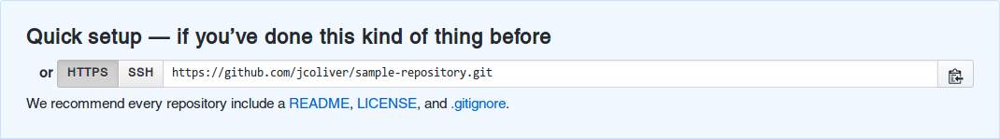
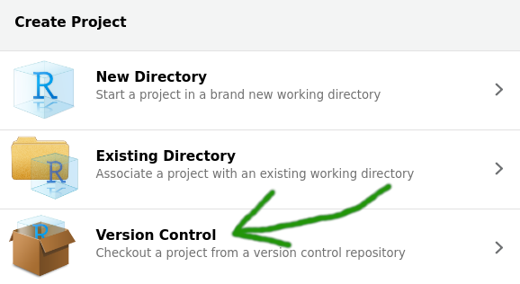
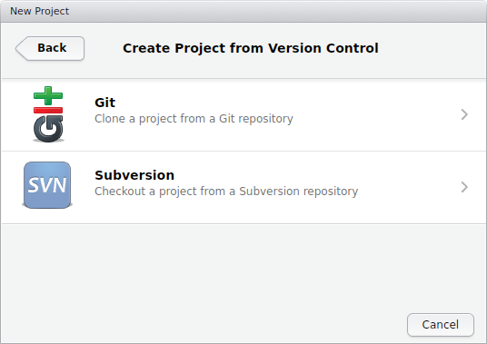
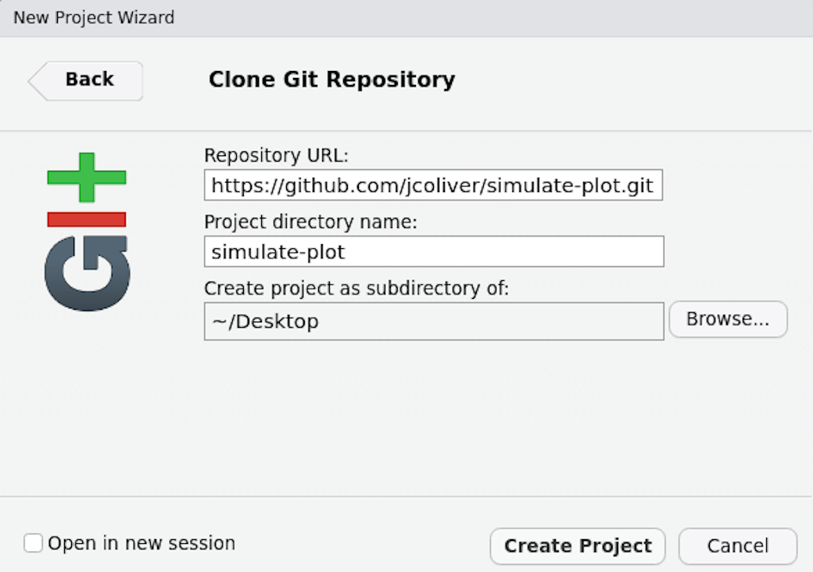
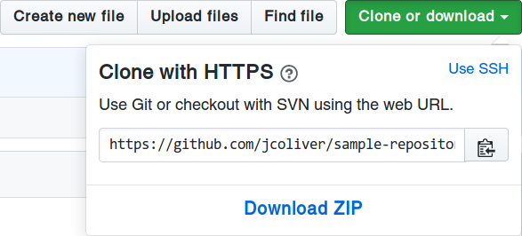

Ready to stop e-mailing code to your collaborators? Want a better way of keeping track of the changes you make on your programming projects? The Git system is designed to make collaboration easier and more transparent. This lesson provides an introduction to the version control system Git, one central sharing point called GitHub, and how you can use the two in RStudio.

#### Learning objectives
1. Be able to explain the difference between Git and GitHub
2. Track changes made to local copies of code
3. Contribute code to a public repository on GitHub

## Git vs. GitHub
The oft-asked question: _What is the difference between Git and GitHub?_ has a relatively simple answer. 

+ **Git**: a version control system. It is an open-source piece of software that acts a lot like the "Track Changes" functionality on your favorite word processing program.
+ **GitHub**: a website where you store your work and collaborate with others. GitHub has an instance of Git running on the website, keeping track of your changes as well as your collaborators' changes.
  
Git was originally developed for keeping track of changes in computer programming code, but is now used for much more, including open access journals, blogs, and text books.

Throughout the rest of the lesson, you'll see the word "repository" (or "repo", for short). A repository can be considered a storage system (like a folder on your computer) where your work is kept.

***

## Getting started
You'll need some software to effectively follow along with this lesson. The first is Git; head to the [Downloads page on the Git website](https://git-scm.com/downloads) and install whichever version is appropriate for your operating system. Next you'll need [R _and_ RStudio](https://jcoliver.github.io/learn-r/000-setup-instructions.html).

After installing RStudio, R, and Git, you'll need to configure Git. You can do this through RStudio or in your command line interface of choice. You can access the command line interface in RStudio via Tools > Shell...  

In the shell, type:
```{bash eval = FALSE}
git config --global user.name 'Your Name'
git config --global user.email 'your@email.com'
```
  
Replacing 'Your Name' and 'your@email.com' with your actual name and e-mail (surrounded by single-quotes).
  
Next, if you have not already, [sign up for a GitHub account](https://github.com/join?source=header-home). Registration is free and simple. Make sure you remember your GitHub ID and password - we'll need those later in the lesson.

***

## Decision Time
At this point, you'll want to decide how you are going to connect to GitHub. This lesson covers three options:

1. Start a new repository on GitHub
2. Use an existing GitHub repository
3. Use an existing local repository

After you connect using one of these three options, we'll deal with communication between RStudio and GitHub.

***

### Starting from scratch
1. If you are just starting a project and want to use GitHub for collaboration, it is easiest to start on GitHub. Using your favorite web browser, log into your [GitHub account](https://github.com) and create a new repository. There is usually a big green button "New repository" you can click on.  
  
Give your repository a name and a description, and click the "Create repository" button.  
You should next see a set of instructions for connecting to this repository. The thing to keep track of is the URL in the "Quick setup section":  
  
At this point, leave the browser open and open RStudio. We want to make a new project, using the GitHub repository we just created.

2. Create a new project (File > New Project...)
3. Select the **Version Control** option  

4. Select the **Git** option  

5. Finally, in the dialog that opens, you need only fill in information for the Repository URL (it is your repository URL we saw in the Quick setup section and should end in ".git").  
  
6. Click "Create Project" and you'll be connected. Jump to the [Collaborate!](#collaborate) section below to use Git in RStudio.

***

## Use an existing GitHub repository

If you are going to use a repository that already exists on GitHub, you can head to that repository GitHub site, and click the "Clone or download" button:  

  
That should open a dialog with the repository URL. Copy the URL to the clipboard.  


At this point, follow steps 2-6 in the previous section ([Starting from scratch](#starting-from-scratch)).

***

### Use an existing local repository

Let's say you have code on your machine that you want to push to GitHub. First, log into [GitHub](https://github.com) and create a new repository (see step 1 in [Staring from scratch](#starting-from-scratch), above). Then, to connect RStudio to this repository through the command line interface of RStudio (Tools > Shell...). 

```{bash eval = FALSE}
echo "# sample-repository" >> README.md
git init
git add README.md
git commit -m "first commit"
git remote add origin https://github.com/jcoliver/sample-repository.git
git push -u origin master
```

Make sure to substitute your GitHub repository URL in the `git remote add origin` line.

At this point, shut down and restart RStudio to complete the integration with GitHub.

***

## Collaborate!

By now you have linked your RStudio project with a GitHub page. For the purposes of this lesson, we want to consider two Git repositories:

+ Your _local_ repository, i.e. the files on your computer
+ The _remote_ repository, i.e. the files that live on the GitHub website

The general process of working with remote repositories is:

**Pull** > Make changes > **Add** > **Commit** > **Push** > Repeat  
  
The steps in bold are actual Git commands. We'll go through all these in a bit more detail:

+ **Pull**: This downloads any file updates from the GitHub repository and tries to incorporate them into your local copy. This step is often forgotten, which can cause some headaches later on, so try to remember to start your session with a _pull_. You can pull the latest code from GitHub with the blue Pull button in the **Git** tab of the (usually) top-right panel in RStudio.
+ Make changes: At this point you can add more files, change files that exist, or delete files you don't need any more. Just remember to save your changes.
+ **Add**: The _add_ command instructs Git that you would like to make Git aware of any changes you made to files on your local repository (saving _isn't_ enough in this case). After you have made your changes (and saved them!), add them by clicking the "Staged" box next to the file name in the **Git** tab of RStudio.
+ **Commit**: And the last thing you'll need to do to record those changes on your local Git repository is to _commit_ the changes. In RStudio, click the "Commit" button in the **Git** tab. The dialog that opens will show the changes you are about to commit; be sure to write a commit message in the "Commit message:" dialog. Make it brief but informative. _Do not_ skip the commit message, regardless of what [Randall Munroe might say](https://xkcd.com/1296/). Note only those changes that were added will be included in the commit.
+ **Push**: Finally, you want to move those committed changes up to the remote (GitHub) repository. The green Push button will send any changes to GitHub. Note that you will need your GitHub ID and password to push changes to the remote repository. Also note that if you are pushing to a GitHub repository that you did not create, you will need to be [added as a collaborator](https://help.github.com/articles/inviting-collaborators-to-a-personal-repository/) by the repository owner.
+ Repeat: This step is pretty self-explanatory.  

***

## Additional resources

+ Official RStudio Git [support page](https://support.rstudio.com/hc/en-us/articles/200532077-Version-Control-with-Git-and-SVN)
+ Software Carpentry [Git and RStudio lesson](http://swcarpentry.github.io/git-novice/14-supplemental-rstudio/)
+ Library Carpentry [Git lesson](https://data-lessons.github.io/library-git/)
+ A [PDF version](https://jcoliver.github.io/learn-r/010-github.pdf) of this lesson

***

Questions?  e-mail me at <a href="mailto:jcoliver@email.arizona.edu">jcoliver@email.arizona.edu</a>.