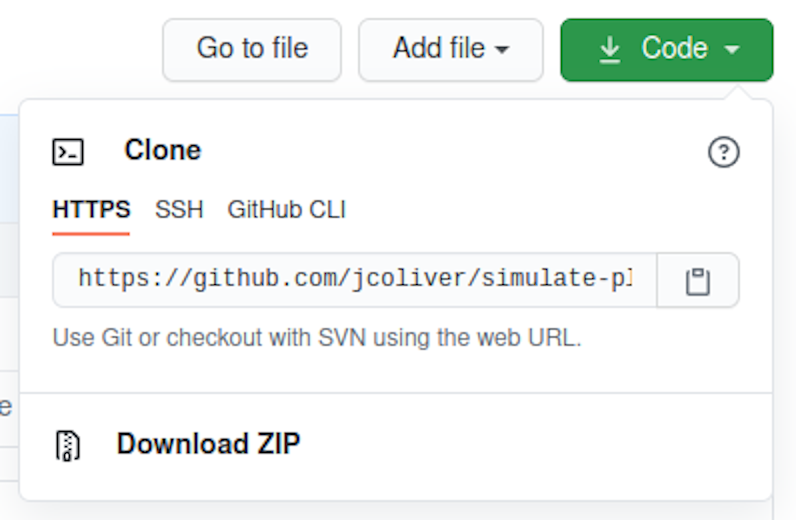

Ready to stop e-mailing code to your collaborators? Want a better way of 
keeping track of the changes you make on your programming projects? The Git 
system is designed to make collaboration easier and more transparent. This 
lesson provides an introduction to the version control system Git, one 
central sharing point called GitHub, and how you can use the two in RStudio.

#### Learning objectives

1. Be able to explain the difference between Git and GitHub
2. Track changes made to local copies of code
3. Contribute code to a public repository on GitHub

## Git vs. GitHub

The oft-asked question: _What is the difference between Git and GitHub?_ has a
relatively simple answer. 

+ **Git**: a version control system. It is an open-source piece of software 
that acts a lot like the "Track Changes" functionality on your favorite word
processing program.
+ **GitHub**: a website where you store your work and collaborate with others.
GitHub has an instance of Git running on the website, keeping track of your 
changes as well as your collaborators' changes.
  
Git was originally developed for keeping track of changes in computer 
programming code, but is now used for much more, including open access 
journals, blogs, and text books.

Throughout the rest of the lesson, you'll see the word "repository" (or "repo", 
for short). A repository can be considered a storage system (like a folder on 
your computer) where your work is kept.

***

## Getting started

Make sure you have 
[R _and_ RStudio](https://jcoliver.github.io/learn-r/000-setup-instructions.html)
installed on your machine.

You'll need to have Git installed to take advantage of this version control 
functionality. To see if you have Git installed on your system, open RStudio 
and select Global Options from the Tools menu (Tools > Global Options...). In 
the dialog that opens, click the Git/SVN tab on the left-hand side of the 
pop-up window. Near the top of the pane, there is a field for the Git 
executable. If it says something like "/usr/bin/git" or "C:/Program Files/Git/" 
then you already have Git installed. Yay! If instead it says "(Not Found)" in 
the Git executable field, then you will need to install Git before proceeding.

{ width=50% }  

(Another way you can do this is to use the command line to check for Git. On 
Windows, you can run `which git` in your command prompt; on Mac OS or Linux, 
you can run `git --version`)

If Git is _not_ installed on your machine, head to the 
[Software Carpentry instructions for Git](https://carpentries.github.io/workshop-template/#git) 
and install whichever version is appropriate for your operating system. You 
only need to do this step if the previous step indicated that Git was not 
installed on your computer. After you install Git, **shutdown and restart 
RStudio**.

After installing Git, you'll need to configure Git. You can do this through 
RStudio or in your command line interface of choice. In RStudio, open a new 
Terminal via Tools > Terminal > New Terminal and enter:

```{bash git-config, eval = FALSE}
git config --global user.name 'Your Name'
git config --global user.email 'your@email.com'
```
  
Replacing `'Your Name'` and `'your@email.com'` with your actual name and e-mail 
(surrounded by single-quotes).
  
Next, if you have not already, 
[sign up for a GitHub account](https://github.com/join?source=header-home) at 
github.com. Registration is free and simple. Make sure you remember your GitHub 
ID and password - we'll need those later in the lesson.

### xcrun: error: invalid active developer path

What? On some versions of Mac OS, you will need to install _one more_ program 
in order to get RStudio and Git to talk with each other. If you see an error 
like 

```{bash xcrun-error, eval = FALSE}
xcrun: error: invalid active developer path (/Library/Developer/CommandLineTools), 
missing xcrun at: /Library/Developer/CommandLineTools/usr/bin/xcrun.
```

shut down RStudio, open the Terminal application and run

```{bash xcrun-install, eval = FALSE}
xcode-select --install
```

open RStudio again and you should be all set! If you want to know more about
this error, head over to Stack Overflow and read about 
[this in more detail](https://apple.stackexchange.com/questions/254380/why-am-i-getting-an-invalid-active-developer-path-when-attempting-to-use-git-a).

***

### We can't have nice things

In the old days, we were able to send changes from our machine to GitHub with 
our username and password. But in those days we were also using poor passwords, 
like "1234" or "password", which makes it easy for bad actors to mess with our 
code. To counter this, GitHub now requires us to take different authentication 
approaches. You can read about the various approaches on [GitHub Docs](https://docs.github.com/en/authentication/keeping-your-account-and-data-secure/about-authentication-to-github), 
but for this lesson we will focus on Personal Access Tokens. These are 
effectively really long, random passwords that are harder to guess. The GitHub 
instructions for generating a token are at [https://docs.github.com/en/authentication/keeping-your-account-and-data-secure/creating-a-personal-access-token#creating-a-token](https://docs.github.com/en/authentication/keeping-your-account-and-data-secure/creating-a-personal-access-token#creating-a-token)

A couple of notes on those instructions:

+ In step 5, when you click "Generate a new token", the website may prompt you 
for your password. For this field, use the password you use to log in to the 
GitHub website.
+ In step 6, "Give your token a descriptive name." I will use the name of the 
computer I am using. This way if I upgrade my machine, my computer dies, or god 
forbid, someone steals it, I can revoke the token access.
+ In the expiration options in step 7, make this a short duration if you are 
using a public machine or a loaner. Remember you can always delete this token 
if you need to.
+ For scopes in step 8, check the box that says "*repo*".

When you click the "Generate token" button, you will be taken to a new site 
that displays this token. _This is the only time GitHub will **ever** show you
this token_. I'm going to leave this tab in my browser open so I can copy the 
token later in the lesson. If you are worried that you might close the tab, you 
can copy and paste it into a text editor (_not_ in RStudio) for use later on. 
If you lose your token, no worries, you can generate a new one (and delete the 
one you lost).

Now when you are working in RStudio and you are asked for your GitHub password,
you will paste that long token into the window. We'll see this in action later 
in the lesson.

***

## Decision Time

At this point, you'll want to decide how you are going to connect to GitHub. 
This lesson covers three options:

1. Start a new repository on GitHub
2. Use an existing GitHub repository
3. Use an existing local repository

After you connect using one of these three options, we'll deal with 
communication between RStudio and GitHub.

***

### 1. Starting from scratch

1. If you are just starting a project and want to use GitHub for collaboration, 
it is easiest to start on GitHub. Using your favorite web browser, log into 
your [GitHub account](https://github.com) and create a new repository. There is
usually a big green button "New repository" or "New" you can click on.  

{ width=25% }  

For this lesson,

+ enter "simulate-data" in the **repository name** field, and 
+ "A repository for simulating and plotting data" in the **description** field, 
and click the "Create repository" button. Give yourself a pat on the back: You
are using GitHub!

At this point, leave the browser open and open RStudio. We want to make a new 
project, using the GitHub repository we just created.

2. Create a new project (File > New Project...)
3. Select the **Version Control** option

{ width=50% }  
4. Select the **Git** option  
{ width=50% }  

5. Finally, in the dialog that opens, you need only fill in information for the 
Repository URL. You can copy the URL to the clipboard by navigating to your 
GitHub repository website, clicking the green "code" button:

{ width=50% }  

This should open a dialog with the URL (it will start with "https" and end with 
".git"). Copy the URL by clicking the clipboard icon.

{ width=50% }  


Return to RStudio and paste into the Repository URL field:

{ width=50% }  

6. Click "Create Project" and you'll be connected. Jump to the 
[Collaborate!](#collaborate) section below to use Git in RStudio.

***

### 2. Use an existing GitHub repository

If you are going to use a repository that already exists on GitHub, you can 
head to that repository GitHub site, and click the "Clone or download" button:

{ width=25% }  
  
That should open a dialog with the repository URL. Copy the URL to the 
clipboard.

{ width=50% }  

At this point, follow steps 2-6 in the previous section 
([Starting from scratch](#starting-from-scratch)).

***

### 3. Use an existing local repository

Let's say you have code on your machine that you want to push to GitHub. First, 
log into [GitHub](https://github.com) and create a new repository (see step 1 
in [Staring from scratch](#starting-from-scratch), above). Then, to connect 
your machine to this repository through the command line interface of RStudio 
(Tools > Terminal > New Terminal). 

```{bash push-local, eval = FALSE}
echo "# simulate-data" >> README.md
git init
git add README.md
git commit -m "first commit"
git remote add origin https://github.com/jcoliver/simulate-data.git
git push -u origin main
```

Make sure to substitute your GitHub repository URL in the 
`git remote add origin` line.

At this point, shut down and restart RStudio to complete the integration with 
GitHub.

***

## A Warning

You have set things up. Your GitHub repository is ready to use and you have it 
connected to your local RStudio. The next step is to

**Pause.**

It bears mentioning that, by default, the maximum file size on GitHub is 100 
MB (see caveat below). So _before_ you add any file to Git's history on your 
local machine (that is, before you check the box next to the file name in the 
Git tab), make sure the file is less than 100 MB. If you _do_ have files larger
than 100 MB, you want to list them in your .gitignore file (this is a text file
in your repository's folder that lists files you do not want Git to keep track 
of - like large files). One work-around is to compress large files into a zip
file (or file_s_, remember, they need to be below 100 MB) and add that .zip 
file to your Git history.

_Caveat_: You actually can store files larger than 100 MB on GitHub, but you 
will need to set up Git LFS (Large File Storage). If you go this route, you 
will need to set this up _before_ you add any large files to Git's history. Git
LFS can be a bit of a headache to set up, but the official 
[GitHub LFS documentation](https://docs.github.com/en/repositories/working-with-files/managing-large-files/about-large-files-on-github) is a good place to start.

***

## Collaborate!

By now you have linked your RStudio project with a GitHub page. For the 
purposes of this lesson, we want to consider two Git repositories:

+ Your _local_ repository, i.e. the files on your computer
+ The _remote_ repository, i.e. the files that live on the GitHub website

The general process of working with remote repositories is:

**Pull** > Make changes (and save!) > **Add** > **Commit** > **Push** > Repeat  
  
The steps in bold are actual Git commands. We'll go through all these in a bit 
more detail:

+ **Pull**: This downloads any file updates from the GitHub repository and 
tries to incorporate them into your local copy. This step is often forgotten, 
which can cause some headaches later on, so try to remember to start your 
session with a _pull_. You can pull the latest code from GitHub with the blue 
Pull button in the **Git** tab of the (usually) top-right panel in RStudio.
+ Make changes: At this point you can add more files, change files that exist, 
or delete files you don't need any more. Just remember to **save** your 
changes.
+ **Add**: The _add_ command instructs Git that you would like to make Git 
aware of any changes you made to files on your local repository (saving _isn't_
enough in this case). After you have made your changes (and saved them!), add 
them by clicking the "Staged" box next to the file name in the **Git** tab of
RStudio.
+ **Commit**: And the last thing you'll need to do to record those changes on 
your local Git repository is to _commit_ the changes. In RStudio, click the 
"Commit" button in the **Git** tab. The dialog that opens will show the changes 
you are about to commit; be sure to write a commit message in the "Commit 
message:" dialog. Make it brief but informative. _Do not_ skip the commit 
message, regardless of what [Randall Munroe might say](https://xkcd.com/1296/). 
Note only those changes that were added will be included in the commit.
+ **Push**: Finally, you want to move those committed changes up to the remote 
(GitHub) repository. The green Push button will send any changes to GitHub. 
Note that you will need your GitHub ID and password to push changes to the 
remote repository. Also note that if you are pushing to a GitHub repository 
that you did not create, you will need to be 
[added as a collaborator](https://help.github.com/articles/inviting-collaborators-to-a-personal-repository/) 
by the repository owner.
+ Repeat: This step is pretty self-explanatory. :)  

***

### Test it

If you want to test out Git, create a new R script in RStudio via File > New 
File > R Script. Add the following to the script (replacing with your name, 
e-mail address, and current date):

```{r example-script, eval = FALSE}
# Simulate and plot data
# Jeff Oliver
# jcoliver@arizona.edu
# 2021-03-23

# Simulate predictor variable
x <- rnorm(n = 100)
# Simulate response variable with some noise
y <- 2 * x + rnorm(n = 100, sd = 0.2)

# Plot the data
plot(x = x, y = y)
```

Save this file as "simulate-plot-data.R".

#### Now it is time to Git! 

+ Find the Git panel (it should be available in the upper right pane of your 
RStudio window). Click the little box to the left of the file we just created
(simulate-plot-data.R). A check-mark should appear in the box (sometimes you 
have to wait a moment for the check-mark to appear, so be patient). Checking 
that box is the **Add** step described above. 
+ Next we need to **Commit** by pressing the Commit button in the Git pane. In 
the dialog that appears, we want to enter a brief but informative commit 
message. For this commit, type "Initial commit" in the commit message field and 
press the commit button. 
+ The final step in this process is to send these latest changes to GitHub with 
a **Push**. Once again in the Git pane, find the Push button, indicated by a 
green, upward-facing arrow.

{ width=15% }

At this point, you may be prompted to enter your GitHub username and 
password. Be sure to look at what the specific field is asking for (username or
password) as _both_ dialog windows will be titled "Password". Remember for the 
password, you want to paste in your Personal Access Token, that long string of 
numbers and letters we generated at the beginning. 

_Note_: if you have used RStudio to talk with GitHub in the past, you may need 
to force R to ask you for your GitHub credentials. You can do with with the 
[gitcreds](https://cran.r-project.org/web/packages/gitcreds/index.html) package 
for R. If you _were_ prompted for your credentials, you do not need to do the 
steps below.

```{r gitcreds, eval = FALSE}
install.packages("gitcreds")
library(gitcreds)
gitcreds_set()
# Select option 2 and provide credentials at prompts.
```

Return to your web browser with your GitHub repository and refresh the page. 
Your new file (simulate-data.R) should now be shown! Well done!

***

## Additional resources

+ Official RStudio Git [support page](https://support.rstudio.com/hc/en-us/articles/200532077-Version-Control-with-Git-and-SVN)
+ [GitHub LFS documentation](https://docs.github.com/en/repositories/working-with-files/managing-large-files/about-large-files-on-github)
+ Software Carpentry [Git and RStudio lesson](http://swcarpentry.github.io/git-novice/14-supplemental-rstudio/)
+ Library Carpentry [Git lesson](https://data-lessons.github.io/library-git/)
+ A [PDF version](https://jcoliver.github.io/learn-r/010-github.pdf) of this lesson

***

[Back to learn-r main page](index.html)

Questions?  e-mail me at <a href="mailto:jcoliver@arizona.edu">jcoliver@arizona.edu</a>.