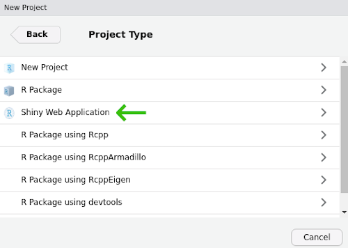

The Shiny package for R provides a way to transform your R code into interactive applications accessible through a web browser. This lesson provides a hands-on example of how you can use Shiny to create intuitive graphical user interfaces.

#### Learning objectives

1. Explain the different responsibilities of the user interface and the server function
2. Manipulate user interface options in side panels
3. Apply defensive programming techniques to reduce errors
4. Diagnose problems with Shiny built-in debugging features
5. Share the application through [shinyapps.io](https://shinyapps.io)

## Description

While the R programming language is immensely popular, not everyone has the time or resources to learn how to use it (a shame, I know). How then, can you share your awesome data visualization tools that you wrote in R? The [Shiny](https://shiny.rstudio.com/) package provides the architecture to build beautiful web applications without writing a single HTML tag. This workshop will introduce some of the functionality of the package as well as platforms you can use to share your work.

***

## Getting started

install packages (shiny, ggplot2, palmerpenguins)

start shiny project

File > New Project > New Directory > Shiny Web Application

***

## [TOPIC ONE]

Look at two parts of file (`ui` and `server` (and  `shinyApp` at the very end of the file))

***

## [TOPIC TWO]

Adding the interactivity

Do panel manipulation with Species first as a text field, then change this to a drop-down menu (defensive programming)

`textInput`

### PEBKAC

We've all been there. Here's the point for defensive programming (changing the text input field to a dropdown dialog)

Maybe also add an option checkbox to color by sex

***

## [TOPIC THREE]

Add some bells & whistles, like the regression model output to the screen with `tableOutput` or `textOutput` functions.

Introduce some error here, so it doesn't show up. Use `runApp(display.mode = "showcase")`

Fix the problem

***

## Sharing is caring

Share the app via shinyapps.io. Acknowledge other sharing resources are in the Additional resources section.

***

## Additional resources

+ [resource one](url-one)
+ The invaluable [Shiny cheat sheet](https://shiny.rstudio.com/images/shiny-cheatsheet.pdf)
+ A [PDF version](https://jcoliver.github.io/learn-r/016-intro-shiny.pdf) of this lesson

***

<a href="index.html">Back to learn-r main page</a>
  
Questions?  e-mail me at <a href="mailto:jcoliver@email.arizona.edu">jcoliver@email.arizona.edu</a>.