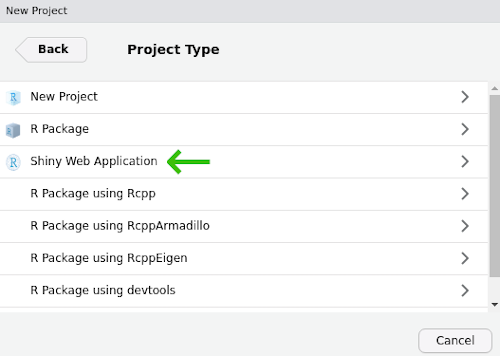
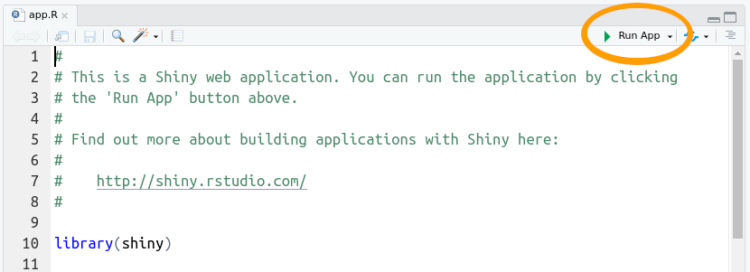
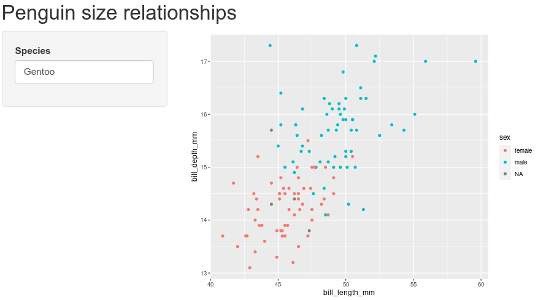
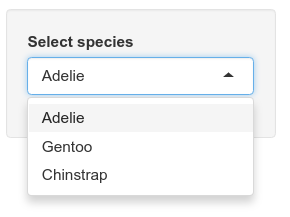
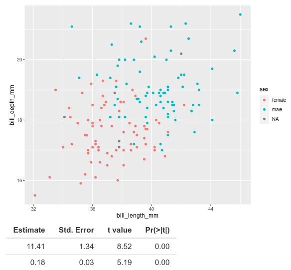
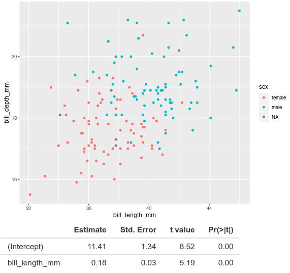

The Shiny package for R provides a way to transform your R code into 
interactive applications accessible through a web browser. This lesson provides 
a hands-on example of how you can use Shiny to create intuitive graphical user 
interfaces.

#### Learning objectives

1. Explain the different responsibilities of the user interface and the server 
function
2. Manipulate user interface options in side panels
3. Apply defensive programming techniques to reduce errors
4. Diagnose problems with Shiny built-in debugging features
5. Share the application through [shinyapps.io](https://shinyapps.io)

## Description

While the R programming language is immensely popular, not everyone has the 
time or resources to learn how to use it (a shame, I know). How then, can you 
share your awesome data visualization tools that you wrote in R? The [Shiny](https://shiny.rstudio.com/) package provides the architecture to build 
beautiful web applications without writing a single HTML tag. This workshop 
will introduce some of the functionality of the package as well as platforms 
you can use to share your work.

***

## Getting started

To start with, we will need to install the [shiny](https://shiny.rstudio.com/) 
package for R. For this lesson, we also be using the 
[ggplot2](https://ggplot2.tidyverse.org/) package for data visualization and 
the [palmerpenguins](https://allisonhorst.github.io/palmerpenguins/) package 
for our data source.

```{r install-packages, eval = FALSE}
install.packages("shiny")
install.packages("ggplot2")
install.packages("palmerpenguins")
```

Note, I misspell "palmerpenguins" more frequently that I would like to admit, 
so if you encounter installation problems with that package, double-check to 
make sure it is spelled correctly.

We are now ready to start our Shiny Application!

+ From the File menu, select New Project...
+ Choose "New Directory" in the first dialog
+ In the Project Type dialog, select "Shiny Web Application", which is probably
the third option in the list. If you do not see this as an option, try shutting 
down RStudio and starting it up again.

{ width=50% }

Name your project "shiny-lesson" and be sure you save it somewhere you can 
remember (I usually save these lessons to the Desktop or My Documents).

***

## Two halves make an app

The shiny application file you just created has the two critical parts:

1. `ui`, which starts on line 13. `ui` handles all communication with the user:
it records choices and information that the user inputs and displays any output
based on those selections.
2. `server` which starts on line 36. `server` takes care of any calculations 
and does the heavy lifting for creating any data visualizations.

The `ui` code:

```{r ui-code, eval = FALSE}
# Define UI for application that draws a histogram
ui <- fluidPage(

    # Application title
    titlePanel("Old Faithful Geyser Data"),

    # Sidebar with a slider input for number of bins 
    sidebarLayout(
        sidebarPanel(
            sliderInput("bins",
                        "Number of bins:",
                        min = 1,
                        max = 50,
                        value = 30)
        ),

        # Show a plot of the generated distribution
        mainPanel(
           plotOutput("distPlot")
        )
    )
)
```

The `server` code:

```{r server-code, eval = FALSE}
# Define server logic required to draw a histogram
server <- function(input, output) {

    output$distPlot <- renderPlot({
        # generate bins based on input$bins from ui.R
        x    <- faithful[, 2]
        bins <- seq(min(x), max(x), length.out = input$bins + 1)

        # draw the histogram with the specified number of bins
        hist(x, breaks = bins, col = 'darkgray', border = 'white')
    })
}
```

There is actually an important third part of the the file, too, at the very 
end. Line 49 has:

```{r run-app, eval = FALSE}
shinyApp(ui = ui, server = server)
```

This command actually starts up the application so you can actually use it, so 
make sure not to delete it.

### Test drive the app

Whenever you start a new Shiny app, the file will have the bare bones of an app 
as in the file you see here. Let us first see what this app does, then we will 
modify it for our own uses. Press the "Run App" button at the top of the app.R
script.

{ width=80% }

This app takes one piece of input from the user (the number of bins to use for 
the histogram) and updates the visualization based on the user's selection.

If we look back at the code in our app script, the `ui` section adds the title 
we see at the top of the app ("Old Faithful Geyser Data") and calls the 
function `sidebarLayout()`. This is where most of your code for communicating 
with the user is going to be. Here it does two things: 

1. Creates the slider with `sliderInput()`
2. Displays the plot with `plotOutput()`

You probably also noted that the slider controls are with a call to 
`sidebarPanel()` and the plot display happens inside a call to `mainPanel()`. 
We will not mess around too much with this, but in general we will use 
`sidebarPanel()` to gather user input and `mainPanel()` for any output we want 
to display.

### Don't start from scratch

Our goal is to create an app that allows users to choose among three species 
of penguins (Gentoo, Adelie, and Chinstrap) and display a plot of bill length 
vs. bill depth.

Now, we want an application that has nothing to do with geyser eruptions, but 
instead of deleting everything in the file and starting from scratch, we start 
by adding comments to indicate what we want to do and commenting out the 
original code. We can delete the old code later, but for now we can keep it to 
remind us of how shiny apps work.

Since our app will use the ggplot2 and palmerpenguins packages, go ahead and 
add library calls to those two packages right after the shiny package is loaded.

```{r load-libraries}
library(shiny)
library(palmerpenguins)
library(ggplot2)
```

Start by updating the title in the call to `titlePanel()`

```{r update-title, eval = FALSE}
titlePanel("Penguin size relationships")
```

Change the comment above sidebar layout to indicate what we want users to do, 
that is, we will want them to select the name of a penguin species.

```{r sidebar-comment, eval = FALSE}
# Sidebar with text input for penguin species
sidebarLayout(
    sidebarPanel(
```

We can also update the comment above the main panel code to reflect the type of 
plot we will display.

```{r mainPanel-comment, eval = FALSE}
# Show a size plot for selected species
```

We are still at the point of writing comments, which are really instructions to 
ourselves about the code we need to write. So scroll on down to the `server` 
section add add a comment before `output$distPlot <- renderPlot` (around line 
37 in the file):

```{r plot-comment, eval = FALSE}
# Create size plot for penguin species
```

***

## _Now_ we start updating the code

At this point we haven't changed much besides some comments. If you run the app, 
it is still going to be the one plotting eruptions of Old Faithful. There are 
two changes we need to make to the actual code: one in the `ui` function and 
one in the `server` function. The first (in `ui`) is all about getting 
information from the user. 

Navigate to the sidebar panel, has a `sliderInput` function:

```{r sidebar-original, eval = FALSE}
# Sidebar with text input for penguin species
sidebarLayout(
    sidebarPanel(
      sliderInput("bins",
                  "Number of bins:",
                  min = 1,
                  max = 50,
                  value = 30)
  ),
```

Start by deleting the `sliderInput`:

```{r sidebar-panel-empty, eval = FALSE}
# Sidebar with text input for penguin species
sidebarLayout(
    sidebarPanel(
    ),
```

And add, inside the call to `sidebarPanel`, a call `textInput`:

```{r sidebar-panel-input, eval = FALSE}
# Sidebar with text input for penguin species
sidebarLayout(
    sidebarPanel(
      textInput(inputId = "species",
                label = "Species",
                value = "Gentoo")
    ),
```

For `textInput`:

1. `inputId = "species"` is the identifier for the information the user enters; 
we will see this in use later in the `server` section. Just remember that we 
used all lower-case letters.
2. `label = "Species"` is the text that will appear to the user. Note here we 
capitalized "Species".
3. `value = "Gentoo"` indicates the default value that `species` will take.

The next change occurs in the `server` section. Navigate to the comment we 
added about creating a plot (around line 35 of the file):

```{r plot-original, eval = FALSE}
# Create size plot for penguin species
output$distPlot <- renderPlot({
    # generate bins based on input$bins from ui.R
    x    <- faithful[, 2]
    bins <- seq(min(x), max(x), length.out = input$bins + 1)

    # draw the histogram with the specified number of bins
    hist(x, breaks = bins, col = 'darkgray', border = 'white')
})
```

Since we are not going to use the code for plotting a histogram, we can delete 
all the code within `renderPlot` (but be sure to leave the opening `({` and 
closing `})`):

```{r plot-empty, eval = FALSE}
# Create size plot for penguin species
output$distPlot <- renderPlot({
  
})
```

And we now add our ggplot2 commands to create a scatter plot of bill depth 
versus bill length. (not familiar with ggplot2? Check out the 
[introduction to ggplot lesson](https://jcoliver.github.io/learn-r/004-intro-ggplot.html)).

```{r plot-input-01, eval = FALSE}
# Create size plot for penguin species
output$distPlot <- renderPlot({
    ggplot(data = penguins[penguins$species == input$species, ], 
           mapping = aes(x = bill_length_mm, 
                         y = bill_depth_mm,
                         color = sex)) +
    geom_point()
})
```

Note the data we specified to use for the plot:

```{r data-subset-01, eval = FALSE}
data = penguins[penguins$species == input$species, ]
```

`penguins$species` is the data set we loaded from the palmerpenguins package, 
but what about that `input` thing? Where did that come from? Remember the work 
we did on the `SidebarPanel`, and the `inputId`? The `input` object in the 
`server` section of our app has all the information we collect from the `ui` 
section of our app. We will play with this more in a bit, but now it is time to 
test our app! Save any changes to your app.R file, and press the Run App button
in the top-right of your script. You should see

{ width=80% }

Try replacing "Gentoo" with "Chinstrap", then with "Adelie". Note the points 
change in the plot for the different species.

### PEBKAC

If you are like me, you probably managed to misspell "Adelie". If you didn't, 
try it. What happens? When we enter the name of a species that does not 
correspond to the three species in the data set (or if you misspell them), R 
will try to pull out data for species that do not exist. You can see this 
behavior by typing the following in your R console:

```{r zero-rows}
penguins[penguins$species == "Adele", ]
```

The resulting data has zero rows because there are no rows with "Adele" in the 
species column. remember that when we used this syntax in our `server` section, 
it was pulling the value from `input$species`:

```{r data-subset-02, eval = FALSE}
data = penguins[penguins$species == input$species, ]
```

If a user types in an incorrect value, R will try to make a plot anyways. But 
if your user does not know how to spell Adelie, their error will not be 
evident. To improve the experience a user will have when interacting with your 
Shiny app, we can use 
[Defensive programming](https://en.wikipedia.org/wiki/Defensive_programming) 
techniques to reduce these errors. In our app, we let users type in the name of 
the penguin species, but instead of a text box, we can use a dropdown menu so 
users could _only_ choose species that match rows in the penguins data. Let us 
change the input from `textInput` to a dropdown menu. Start by navigating to 
the `sidebarPanel` call:

```{r sidebar-panel-text, eval = FALSE}
# Sidebar with text input for penguin species
sidebarLayout(
    sidebarPanel(
      textInput(inputId = "species",
                label = "Species",
                value = "Gentoo")
    ),
```

and replace `textInput` with a call to `selectInput`:

```{r sidebar-panel-select, eval = FALSE}
# Sidebar with text input for penguin species
sidebarLayout(
    sidebarPanel(
      selectInput(inputId = "species",
                  label = "Select species",
                  choices = unique(penguins$species))
    ),
```

We will leave `inputId` as the same value, after all, the `server` section is 
expecting a value for which species to use. We can update `label` to provide a 
little more guidance for the user. Finally, instead of providing a default 
value, we provide a list of choices; in this case, the only options available 
are the unique values in the `species` column of the `penguin` data. You can 
see these values by typing the following in the console:

```{r unique-species}
unique(penguins$species)
```

Once you have the `selectInput` information added, save the file and run the 
app with the Run app button. Now the text input field should be replaced with 
a dropdown menu of penguin species. No more misspelled species names!



***

## Shiny: not just for plots

We are not limited to only providing graphical output. We can also provide the 
use text or tabular output. We can see this by adding the results of a linear 
regression model to the output of our app. This time, we are going to work 
backwards: first we will write code in the `server` section to run the linear 
model, then we will update the `ui` section to show the results. Navigate to 
the `server` section with your ggplot code:

```{r plot-input-02, eval = FALSE}
# Create size plot for penguin species
output$distPlot <- renderPlot({
    ggplot(data = penguins[penguins$species == input$species, ], 
           mapping = aes(x = bill_length_mm, 
                         y = bill_depth_mm,
                         color = sex)) +
    geom_point()
})
```

Immediately following that closing `})`, we can add the code for regression. 
But before we do, note where our plot is stored. That is, all the code for our 
plot is in a call to `renderPlot` and _that_ is assigned to the variable 
`output$distPlot`. Hmm, `output` you say? Just like we use the `input` variable 
to send information from the `ui` section to the `server` section, we can use 
`output` to send information in the opposite direction (`server` $\rightarrow$ 
`ui`). So we start by creating a new variable in the `output` object, and use 
the `renderTable` method instead of `renderPlot`. Remember to add a comment 
about the rationale for the code. We start after the `})` from `renderPlot`:

```{r table-empty, eval = FALSE}
    geom_point()
})
# Add results of a linear model to output
output$statsTable <- renderTable({
  
})
```

Inside the call to `renderTable`, we can add the R code for performing a linear 
regression between bill length and bill width, extracting the summary 
statistics from the model, and pulling out the coefficient estimates from the 
model:

```{r table-comments, eval = FALSE}
# Add results of a linear model to output
output$statsTable <- renderTable({
    # Create the linear model

    # Extract summary statistics

    # Print coefficient table

})
```

And with those comments in place, we can fill in code as appropriate:

```{r table-model, eval = FALSE}
# Add results of a linear model to output
output$statsTable <- renderTable({
    # Create the linear model
    model <- lm(formula = bill_depth_mm ~ bill_length_mm,
                data = penguins[penguins$species == input$species, ])
    # Extract summary statistics
    model_summary <- summary(model)
    # Print coefficient table
    model_summary$coefficients
})
```

Note that our plot shows one penguin at a time, so we need to be sure to subset 
the data in our call to `lm` like we did for the plot. We do this by using the 
value stored in `input$species` like we did previously:

```{r data-subset-03, eval = FALSE}
data = penguins[penguins$species == input$species, ]
```

So we updated our `server` to run a model, but how do we get it to show up? If 
you press the Run App button, you'll notice that nothing is changed. Just like 
the plot, we have to explicitly tell the `ui` section to display the 
information. To do this, navigate to the `mainPanel` function in the `ui` 
section (it should be around line 29):

```{r main-panel-plot, eval = FALSE}
# Show plot
mainPanel(
    plotOutput("distPlot")
)
```

We need to add the results from our linear regression model to the main panel 
output. For the plot, we used `plotOutput`, but since we are displaying a 
table, we use...wait for it...`tableOutput`. After the call to `plotOutput`, 
add a comma, then a call to `tableOutput`, referencing the variable with our 
table:

```{r main-panel-table, eval = FALSE}
# Show plot and statistical results
mainPanel(
    plotOutput("distPlot"),
    tableOutput("statsTable")
)
```

Note we need to have quotes around the reference `"statsTable"`. Now you can 
save your file and run the app (press Run App in upper right corner of the 
panel). If you see an error that includes

```
36:            plotOutput("distPlot")
37:            tableOutput
               ^
Possible missing comma at:
37:           tableOutput("statsTable")
              ^
```

be sure that you have a comma after `plotOutput("distPlot")`. When you run the 
app, you should now see, below the plot, the results of the linear regression 
model.



The coefficient estimates and associated statistics show up, but we do not 
know what they are estimates for. When we look at this table in R, normally we 
see that the first row corresponds to the intercept and the second row to our 
coefficient for bill length.

```{r model-output}
# Create the linear model
model <- lm(formula = bill_depth_mm ~ bill_length_mm,
            data = penguins[penguins$species == "Gentoo", ])
# Extract summary statistics
model_summary <- summary(model)
# Print coefficient table
model_summary$coefficients
```

(If R complains that it cannot find "penguins", make sure the library is loaded 
by running `library(palmerpenguins)` in the console).

The output shows `(Intercept)` and `bill_length_mm`, but these turn out to be 
row names for the coefficients matrix. Taking a look at the documentation for 
`renderTable` (type `?renderTable` into the console), we see that the default 
value of `rownames` is `FALSE` (look at the **Usage** section in the 
documentation). So maybe if we pass `rownames = TRUE` to `renderTable`, it will 
fix the problem. Let's update the `server` section where `renderTable` is 
called. That is, right after the closing curly brace, `}`, in `renderTable`, 
but _before_ the closing parentheses, `)`, add `, rownames = TRUE`:

```{r table-model-rownames, eval = FALSE}
# Add results of a linear model to output
output$statsTable <- renderTable({
    # Create the linear model
    model <- lm(formula = bill_depth_mm ~ bill_length_mm,
                data = penguins[penguins$species == input$species, ])
    # Extract summary statistics
    model_summary <- summary(model)
    # Print coefficient table
    model_summary$coefficients
}, rownames = TRUE)
```

Save your app file and run it again and the names of the coefficients in the 
model should now appear with the results.



***

## Sharing is caring

If you want to make your app available to other people on the web, the easiest 
way of sharing is through the [shinyapps.io](https://www.shinyapps.io/) 
website. This resource, managed by the folks at RStudio, allows you to publish 
your app online so anyone with a web browser can use it. You can sign up for an 
account, or sign in with your GitHub credentials at
[https://www.shinyapps.io/admin/#/login](https://www.shinyapps.io/admin/#/login). 
After signing in, you can follow instructions on the shinyapps.io page for 
publishing your app.

***

The final app.R file will look like this:

```{r final-script, eval = FALSE}
# A Shiny app showing penguin bill size relationships
# Jeff Oliver
# jcoliver@arizona.edu
# 2021-07-30

library(shiny)
library(palmerpenguins)
library(ggplot2)

# Define UI for application that draws a scatterplot
ui <- fluidPage(

    # Application title
    titlePanel("Penguin size relationships"),

    # Sidebar with text input for penguin species
    sidebarLayout(
        sidebarPanel(
            selectInput(inputId = "species",
                        label = "Species",
                        choices = unique(penguins$species))
        ),
        
        # Show plot and statistical results
        mainPanel(
           plotOutput("distPlot"),
           tableOutput("statsTable")
        )
    )
)

# Define server logic required to draw a scatterplot
server <- function(input, output) {

    # Make plot of bill depth vs. bill length
    output$distPlot <- renderPlot({
        ggplot(data = penguins[penguins$species == input$species, ], 
               mapping = aes(x = bill_length_mm, 
                             y = bill_depth_mm,
                             color = sex)) +
            geom_point() +
            xlab("Bill length (mm)") +
            ylab("Bill depth (mm)")
    })
    
    # Add results of a linear model to output
    output$statsTable <- renderTable({
        # Create the linear model
        model <- lm(formula = bill_depth_mm ~ bill_length_mm,
                    data = penguins[penguins$species == input$species, ])
        # Extract summary statistics
        model_summary <- summary(model)
        # Print coefficient table
        model_summary$coefficients
    }, rownames = TRUE)
}

# Run the application 
shinyApp(ui = ui, server = server)
```

***

## Additional resources

+ The invaluable [Shiny cheat sheet](https://raw.githubusercontent.com/rstudio/cheatsheets/main/shiny.pdf)
+ Posit's resources for [debugging Shiny apps](https://shiny.posit.co/r/articles/improve/debugging/)
+ An [interactive Shiny course](https://rstudio-education.github.io/shiny-course/)
+ [shinyapps.io](https://www.shinyapps.io/) will host your app so other people 
can use it
+ If you want to build interactive maps in Shiny, take a look at the 
[leaflet package](https://rstudio.github.io/leaflet/shiny.html).
+ You can also build Shiny apps to work with data that your users upload. 
Uploads are usually handled by the `fileInput` function (see [documentation](https://shiny.posit.co/r/reference/shiny/1.6.0/fileinput))
and you can find an example of its use in this [RStudio example](https://shiny.posit.co/r/articles/build/upload/).
+ If you want a different look from the default Shiny theme, try
    + The [shinythemes](https://rstudio.github.io/shinythemes/) package for 
    different color schemes. The [Shiny theme selector](https://shiny.rstudio.com/gallery/shiny-theme-selector.html)
    provides examples of all available themes in the package
    + The [bslib](https://rstudio.github.io/bslib/) package to create a custom 
    theme. More information on using bslib can be found on RStudio's [page on 
    theming](https://shiny.rstudio.com/articles/themes.html)
    + The [thematic](https://rstudio.github.io/thematic/) package makes it 
    easier to theme graphics from ggplot2, lattice, and even base R!
+ A [PDF version](https://jcoliver.github.io/learn-r/016-intro-shiny.pdf) of 
this lesson

***

[Back to learn-r main page](index.html)

Questions?  e-mail me at <a href="mailto:jcoliver@arizona.edu">jcoliver@arizona.edu</a>.