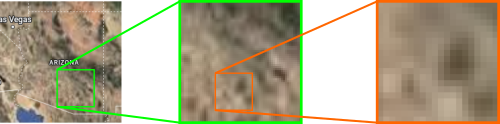
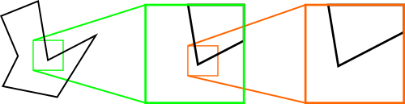
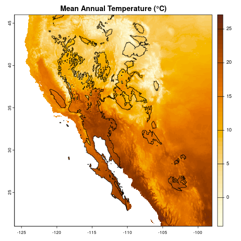
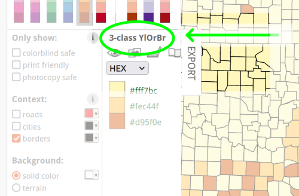

```{r library-check, echo = FALSE, results = "hide"}
#| output: false

libs <- c("terra")
libs_missing <- libs[!(libs %in% installed.packages()[, "Package"])]
if (length(libs_missing) > 0) {
  for (l in libs_missing) {
    install.packages(l)
  }
}
```

An introduction to working with two types of geospatial data in R, with 
examples of displaying data on maps.

#### Learning objectives

After this lesson, learners should be able to:

1. Install packages for geospatial data visualization and analysis
2. Explain the difference between raster and shape data
3. Load geospatial raster data into memory
4. Visualize raster data
5. Change spatial projection of geospatial data
6. Add points to raster data visualization

Geospatial data are data that have some connection to specific places or areas 
on Earth. In this lesson we will look at common geospatial data types and how 
we can work with them in R. We will really be scratching the surface today and 
you can find links to more resources at the end of the lesson.

***

## Getting started

### Workspace organization

First we need to setup our development environment. Open RStudio and create a 
new project via:

+ File > New Project...
+ Select 'New Directory'
+ For the Project Type select 'New Project'
+ For Directory name, call it something like "intro-geo" (without the quotes)
+ For the subdirectory, select somewhere you will remember (like "My Documents" 
or "Desktop")

We need to create two folders: 'data' will store the data we will be analyzing, 
and 'output' will store the results of our analyses. In the RStudio console:

```{r workspace-setup, eval = FALSE}
dir.create(path = "data")
dir.create(path = "output")
```

It is good practice to keep input (i.e. the data) and output separate. 
Furthermore, any work that ends up in the **output** folder should be completely
disposable. That is, the combination of data and the code we write should allow 
us (or anyone else, for that matter) to reproduce any output.

### Install additional R packages

To work with geospatial data in R, we usually need to install one or more 
additional packages. The two most popular packages for geospatial data are 
[terra](https://rspatial.org/pkg/) and [sf](https://r-spatial.github.io/sf/). 
In this lesson, we will only be working with terra, and you can find links for 
more information on terra and on sf at the bottom of the lesson. In order to 
use the terra package, we must first install the package with 
`install.packages()`:

```{r terra-install, eval = FALSE}
install.packages("terra")
```

And we load it into memory with the `library()` command:

```{r terra-load, echo = FALSE}
suppressPackageStartupMessages(library(terra))
```

```{r terra-load-print, eval = FALSE}
library(terra)
```

### Some Terms

Geospatial data generally come in one of two types: raster data or vector data. 

+ **Raster** data are gridded data. They generally look like images and have a 
fixed resolution. This means that as you zoom in on raster data, you eventually 
start seeing the grids. Like when you zoom in on a photograph and it becomes 
"pixelated" - we will see an example of this later. Raster data are usually 
quantitative measurements of some sort, such as temperature, precipitation, and
reflectance in certain light wavelengths.
+ **Vector**, or shape, data are defined by specific coordinates on the Earth's 
surface and do not, technically, have a fixed resolution. This means that as 
you zoom in on Vector data, it never becomes "pixelated". Vector data usually 
take the form of points (a single pair of coordinates), lines (two or more 
coordinate pairs connected in a sequence), or polygons (three or more 
coordinate pairs connected in a closed sequence). Note: I apologize at this 
point for any confusion between the definition of geospatial vector data and 
the vector data structure in R. They are not the same thing, even though they 
probably have similar roots.





### Today's Destination

Today we will work with both raster and vector data, loading it into R, doing
some exploratory visualization, and modifying the data. Ultimately, we are 
going to create a map of temperature data of southwestern North America, 
highlighting those areas that are desert biomes. At the end, we should have a 
map that looks like:



### Climate data

Today we will be working with climate data, specifically mean temperatures and 
annual precipitation. All the data we will use in this lesson come from the 
[WorldClim](https://www.worldclim.org/data/worldclim21.html) site. If you want 
the gritty details, we are using a pair of the standard "bioclim" variables: 
bio1 (annual mean temperature) and bio12 (annual precipitation) at 2.5 minute 
resolution. We need to download these two files:

+ temperature: [https://bit.ly/r-global-temp](https://bit.ly/r-global-temp) 
(which redirects to [https://raw.githubusercontent.com/jcoliver/learn-r/gh-pages/data/global-temperature.tif](https://raw.githubusercontent.com/jcoliver/learn-r/gh-pages/data/global-temperature.tif))
+ precipitation: [https://bit.ly/r-global-prec](https://bit.ly/r-global-prec)
(which redirects to [https://raw.githubusercontent.com/jcoliver/learn-r/gh-pages/data/global-precipitation.tif](https://raw.githubusercontent.com/jcoliver/learn-r/gh-pages/data/global-precipitation.tif))

Place both the files in the "data" folder in the project you created at the 
start of the lesson.

***

## Geospatial raster data

### Reading and Visualizing Raster Data

To read raster data into R, we use the `rast()` function from the terra 
library.

```{r read-temperature-data}
temp <- rast("data/global-temperature.tif")
```

If you see an error that says something like: 

```
Error in rast("global_temperature.tif") : could not find function "rast"
```

it probably means you need to load the terra library with `library(terra)`
_before_ you try to load the file with the `rast()` function.

With raster data, they will all (ideally) contain metadata - we can see those 
metadata by running a line of code with the name of the variable that that we 
read the raster into:

```{r print-temperature-data}
temp
```

So there is a lot packed into the output. For our reality check, we will just 
note that the data are global (see the values in the "extent" field) and the 
range of values for mean annual temperature seem right (see the "min value" and 
"max value" fields).

But come on! We are here for maps. Let us see a map! We can plot the actual 
data stored in the raster with the `plot()` command.

```{r plot-global-temperature-data}
plot(temp)
```

### Aside: `plot()` actually means a lot of different things.

A quick note that when we call `plot()`, R will take a look at what information 
we passed to the function, then decide which _version_ of the `plot()` function
to use. We will not go into additional detail here, but consider looking at the 
documentation for the base R version of `plot()` (via `?plot`) and comparing 
that with the version that comes with the terra package (via `?terra::plot`).

### Cropping data

Rarely do we need a map of the entire globe. Rather, we often want to focus on 
parts of the globe. In this lesson we are going to focus on southwestern North 
America, so we need to crop our raster data to that region. In order to do this 
we first define what is called a geographic extent. This is basically a fancy 
way of drawing a line around the area we are interested in. In our case, we 
need to define the geographic limits of what we are calling the southwest; i.e.
the easternmost, westernmost, southernmost, and northernmost points. 

> Question: how would you find the latitude and longitude values to define this 
extent?

::: {.callout-tip appearance="true" collapse="true"}
#### Answer

There are likely multiple ways to find the boundaries, but I used Google Maps. 
On a Google Map showing the geographic area you are interested in, use the 
mouse to right-click / Ctrl-click on one of the corners. A dialog should appear
that shows the latitude and longitude for the point where you clicked. If you 
then click on those coordinates, it will copy them to the clipboard. You can 
then paste them into your code where appropriate. Just be sure to remember that
the first number is latitude (generally considered the y-axis in geospatial 
data) and the second number is longitued (the x-axis in geospatial data).
:::

For this lesson, we can get away with using whole degree values; we will use 
decimal degrees later in the lesson. When defining an area with four values 
(easternmost, westernmost, etc.), we need to be sure to get them in the right 
order. Often (but _not_ always), they are in the following order:

1. xmin = westernmost
2. xmax = easternmost
3. ymin = southernmost
4. ymax = northernmost

```{r define-southwest}
# Lower right: 21, -98
# Upper left: 46, -126
southwest_ext <- ext(c(-126, -98, 21, 46))
```

You will also note that we used negative values for those western hemisphere 
longitudes (-126, -98). The same goes for values in the southern hemisphere.

> Question: Why would we use negative values instead of the letters W and S 
for western longitudes and southern latitudes, respectively?

::: {.callout-tip appearance="true" collapse="true"}
#### Answer

R requires data to be a single type, either numbers or text. If we use the 
W and S (and by extension E and N) designations, such as 126W and 98S, R will 
treat these data as text, not numeric values. This will make our life harder 
when we try to use the data in R. By using _only_ things that R recognizes as 
numbers (for example, -126 and -98), we make it easy for R to use those values 
in geospatial applications (like making maps).
:::


We can do a reality check and print out the value by running the name of the 
extent.

```{r print-extent}
southwest_ext
```

Finally, we can make a new map, with only those values in the area we defined 
by our geographic extent with the `crop()` function from terra.

```{r crop-temperature-data}
temp_sw <- crop(temp, southwest_ext)
```

We can then compare the objects of our original raster:

```{r uncropped-temp}
temp
```

to the cropped raster:

```{r cropped-temp}
temp_sw
```

Just about all the data changed, with the exception of the value in the 
`coord. ref.` field. We will talk more about that field later.

Let us look at the map of our cropped data, again with the `plot()` function.

```{r plot-cropped-temp}
plot(temp_sw)
```

### Modifying data

The _really_ nice thing about modern geospatial package in R is that we can do 
operations on every cell of the data. For example maybe we want to convert our 
temperature values from Celsius to Fahrenheit.

> Question: For our cropped data, how many calculations would this conversion 
require?

::: {.callout-tip appearance="true" collapse="true"}
#### Answer

This calculation needs to happen for every cell in our data. Every. Single. 
Cell. How many cells to we have? Recall that we can print out information about 
our temperature data by running a line of code that contains the name of the 
variable where our temperature data are stored:

```{r answer-num-calculations}
temp_sw
```

And in the `dimensions` field, we see there are `r nrow(temp_sw)` rows and  
`r ncol(temp_sw)` columns. The total number of cells is then the product of 
these two values: `r nrow(temp_sw)` $\times$ `r ncol(temp_sw)` = 
`r format(nrow(temp_sw) * ncol(temp_sw), big.mark = ",")`. So, that means 
converting our data from Celsius to Fahrenheit requires 
`r format(nrow(temp_sw) * ncol(temp_sw), big.mark = ",")` calculations. 
Thankfully, R geospatial packages know that when we to perform mathematical 
operations on a geospatial data object (like our `temp_sw` object), it knows to 
do the operations separately for each cell.
:::

A reminder of the formula for converting Celsius to Fahrenheit:

$$
F = (C \times \frac{9}{5}) + 32
$$

```{r temp-conversion}
# (C * 9/5) + 32 = F
temp_sw_f <- (temp_sw * 9/5) + 32
```

And plotting the data, the image looks the pretty much the same, but note the 
scale is different:

```{r plot-fahrenheit}
plot(temp_sw_f)
```

### Aside: The world is not flat, so why is my map?

> Question: What are some differences between the map we see on our screen 
and reality?

::: {.callout-tip appearance="true" collapse="true"}
#### Answer

Look at Antarctica! It's huge and not in a shape we immediately recognize 
as Antarctica. The sizes of land masses can only really be compared across 
similar latitudes - the closer one gets to the poles, the greater the 
distortion that arises when when forcing a three-dimensional shape (i.e. the 
sphere of the Earth) into a two-dimensional space (i.e. the map on our 
screens).
:::

The process of taking the three-dimensional shape of the Earth and presenting 
it in a two-dimensional format (i.e. a map) is called projection and there are 
several ways of doing this. And when I say several, I actually mean infinite. 
From the [Wikipedia page on map projections](https://en.wikipedia.org/wiki/List_of_map_projections): 
"Because there is no limit to the number of possible map projections, there can 
be no comprehensive list." However, there are common ones that you should 
probably stick to.

When working in R, the coordinate reference system describes how the three-
dimensional data are transformed into two-dimensional space.

Let us look once more at our cropped temperature raster metadata.

```{r show-wgs84}
temp_sw
```

Specifically, we see the value in the coord. ref. field is 

`lon/lat WGS 84 (EPSG:4326)`

Without going into too much detail, this tells us it uses the World Geodetic 
System 84 reference system with latitude and longitude. This is a pretty good
one to use as long as your maps aren't super close to the poles. _All_ 
projections from three-dimensional space to two-dimensional space result in 
some distortions, and this one really stretches out area near the poles. You 
can see this in action by plotting your original map:

```{r show-pole-distortion}
plot(temp)
```

Look at Antarctica! It's huge!

We can change the way our map looks by re-projecting the raster. That is, we 
make a new object in R that uses a different coordinate reference system. You 
might have noticed in the coord. ref. field that there was the extra bit of 
text in parentheses: "(EPSG:4326)". Thankfully there is a set of unique 
identifiers for all the different coordinate reference systems and we can use 
those identifiers to re-project our data. These identifiers all start with the 
letters "epsg" and end with a series of four to five numbers.

As an example, we can re-project our southwest temperature data to a 
projection that does not distort the area quite as much. We do this with the 
terra function `project()` and then plot the result:

```{r reproject-temp}
temp_sw_reproject <- project(temp_sw, "epsg:5070")
plot(temp_sw_reproject)
```

> Question: What is the name of the coordinate system that EPSG 5070 refers 
to?

::: {.callout-tip appearance="true" collapse="true"}
#### Answer

Using your handy-dandy search engine of choice, you can search for "EPSG 5070" 
and see it is the [Conus Albers projection](https://en.wikipedia.org/wiki/Albers_projection) 
of North America.
:::


### Colors on maps

So, we have a map, but these colors make me think of elevation, not 
temperature, so how can we change this? Let's start by looking at the 
documentation one of the functions for creating color palettes, called 
`rainbow()`:

```{r color-documentation, eval = FALSE}
# Brings up R documentation for some color palettes
?rainbow
```

This actually brings up documentation for a bunch of palettes, but looking at 
the entry in the **Usage** section for `rainbow()`, we see that we need to give
it a value for the number of colors, `n`. Let us try passing the rainbow 
palette to the plot function, giving it fifty colors:

```{r rainbow-colors}
plot(temp_sw, col = rainbow(n = 50))
```

Well, the colors changed, but I would not say for the better. In fact, when I 
go about making decisions about colors, my go-to resource is ColorBrewer at 
[https://colorbrewer2.org](https://colorbrewer2.org).

You can click through the options and it will display the different palettes. 
For our purposes, the Yellow-Orange-Brown palette ("YlOrBr") should work well. 
To see the name of the palette, look just to the left of the "EXPORT" tab:



To use these palettes, we replace the `rainbow()` function with the 
`hcl.colors()` function, and indicate which palette we want through the 
`palette` argument:

```{r pick-colors}
plot(temp_sw, col = hcl.colors(n = 50, palette = "YlOrBr"))
```

This is close, but I'd rather reverse the scale, so darker colors indicate 
hotter temperatures. I am going to create a variable that stores these colors
so I do not have to keep writing out the `hcl.colors()` specification.

```{r reverse-colors}
temp_cols <- rev(hcl.colors(n = 50, palette = "YlOrBr"))
plot(temp_sw, col = temp_cols)
```

> Question: What are the values stored in the `temp_cols` variable?

::: {.callout-tip appearance="true" collapse="true"}
#### Answer

You can look at the first six values stored in the `temp_cols` variable with 
the `head()` command:

```{r answer-colors}
head(temp_cols)
```

These are color values based on the hexadecimal coloring system. Briefly, 
colors are indicated by a value in three channels: red, green, and blue. 
Following the pound sign (`#`), the first two characters indicate how much red 
is in the color, the second two characters indicate how much green is in the 
color, and the final two characters indicate how much blue is in the color 
(i.e. `#RRGGBB`). Those characters use a base-16 system, so numbers 0-9 
indicate those values, but letters A-F indicate values 10-15. For example, 
`"#0000FF"` represents pure blue, while `"#FF00FF"` is an equal mix of red and 
blue (also known as magenta).
:::

***

## Geospatial vector data

Now we will switch to vector data, which are all based on coordinates. These 
data commonly come as points (a single pair of coordinates), lines (multiple 
pairs of coordinates), or polygons (multiple pairs of coordinates that define a 
geographical area).

### Adding Points

Let us create a data frame with some city coordinates that we can add to the 
map.

```{r city-data-frame}
cities <- data.frame(city = c("Tucson", "Hermosillo", "Carson City"),
                     lat = c(32.23, 29.02, 39.18),
                     lon = c(-110.95, -110.93, -119.77))
cities
```

To make these data easier to work with our raster object, we are going to 
transform it to a spatial vector, or SpatVector in terra-speak. While we are at 
it, we will tell it to use the same coordinate reference system as the 
temperature data we already loaded in.

```{r cities-vector}
cities_vect <- vect(cities, crs = crs(temp_sw))
```

Looking at the SpatVector object, it doesn't really look very different.

```{r print-cities-vector}
cities_vect
```

Now we can make our map and add those points to the map. Make sure to use 
`add = TRUE` in our second call to `plot()` so it adds the points to the 
already existing map.

```{r add-cities-points}
plot(temp_sw, col = temp_cols)
plot(cities_vect, add = TRUE)
```

Finally, because we stored the names of the cities in our data frame, we can 
also add those.

```{r add-cities-names}
plot(temp_sw, col = temp_cols)
plot(cities_vect, add = TRUE)
text(cities_vect, labels = "city", pos = 4)
```

### Adding Areas (aka Polygons)

What if we want to add areas, not just points, to our map? Here is where we get 
into the realm of polygons. We can do things like add polygons from shapefiles 
that we download or export from a program like ArcGIS. For this lesson, though, 
we are going to make a polygon on the fly and add that to our map.

Going back to our original goal of a map highlighting desert biomes, we will 
define a desert as an area that receives less than 250 millimeters of 
precipitation per year (_Aside_: this definition only goes so far; for example, 
the city of Tucson does not, technically, get counted as being a desert because 
it receives an average of 300 mm of precipitation per year. You can read more 
about [defining deserts on Wikipedia](https://en.wikipedia.org/wiki/Desert#Defining_characteristics)).

So we start by loading in a file with global precipitation data:

```{r read-precipitation-data}
prec <- rast("data/global-precipitation.tif")
prec
```

Then cropping those data to the North American southwest (that we defined 
above).

```{r crop-precipitaton-data}
prec_sw <- crop(prec, southwest_ext)
prec_sw
```

And it is usually good to do a reality check and plot the data, too:

```{r plot-precipitation-data}
plot(prec_sw)
```

Cool. Map looks good and the ranges of precipitation seem reasonable, too. Now 
we need to use this information to identify those areas considered deserts. We 
will use this categorization to draw an outline of desert biomes on our 
temperature map. As we talked about before, we will use the precipitation-based 
definition of a desert, where any spot that received less than 250 mm in annual 
precipitation is categorized as a desert. We start by defining our cutoff and 
then creating a new raster based on values in the precipitation raster.

```{r define-desert}
desert_max <- 250
prec_desert <- prec_sw < desert_max
prec_desert
```

Looking at the raster metadata, we see the big difference is the min and max 
values - they aren't numbers anymore, but are now logicals (`FALSE` and 
`TRUE`). This is because what we stored in the `prec_desert` object was the 
output of a comparison. That is, for each cell in our southwest precipitation 
raster, `prec_sw`, we asked if the value in that cell was less than 250 mm. The 
answer is either `TRUE` or `FALSE`, so that is what is stored in the resulting 
output raster, `prec_desert`. We can also see this when we plot the output:

```{r plot-desert-logical}
plot(prec_desert)
```

The areas that are lighting up in yellow are those "desert" biomes. For now, we 
are going to ignore the limitations of our precipitation-based definition (i.e. 
the southern portion of the Central Valley of California is not generally 
considered a desert).

To add this to our map, though, we do not want a logical raster, rather, we 
want a polygon, in order to draw a border around the deserts. We start by 
changing all the `FALSE` values to missing (`NA`) - if we did not do this, R 
would make _two_ polygons from the data, one for desert areas and one for "not 
desert" areas. We then use the `as.polygons()` function to do the 
transformation and plot the polygon alone as a reality check.

```{r desert-to-polygon}
# Change all FALSE values to missing data
prec_desert[!prec_desert] <- NA
# Convert remaining non-missing values to a polygon (vector data)
desert_poly <- as.polygons(prec_desert)
# Plot polygons (reality check)
plot(desert_poly)
```

Looking good! Now we can plot our temperature map again and add the polygon to 
the map. Feel free to experiment with arguments to change the colors and 
transparency of the desert polygon (hint: look at the documentation for the 
`polys()` function via `?polys` for details on how to do this).

```{r add-desert}
# Plot base temperature map
plot(temp_sw, col = temp_cols)
# Add desert polygon
polys(x = desert_poly)
```

Finally, because we are being pedantic, let us make the plot again, this time 
adding a title explaining what the colors mean ("00B0" is Unicode for the 
degree symbol).

```{r add-title}
plot(temp_sw, col = temp_cols, 
     main = "Mean Annual Temperature (\u00B0C)")
polys(x = desert_poly)
```

And if you are inclined, you can output this map by wrapping all the plotting 
commands within a call to one of the graphics device functions (e.g. `png()`, 
`pdf()`) and then turning off this graphical redirect with `dev.off()`.

```{r save-plot, eval = FALSE}
png(filename = "sw-desert-heat.png")
plot(temp_sw, col = temp_cols, 
     main = "Mean Annual Temperature (\u00B0C)")
polys(x = desert_poly)
dev.off()
```

***

## Glossary

These are the functions we used in this lesson; use the `?` in R to find more 
details (e.g. `?rast`). The following are from the terra package:

+ `as.polygons`: Convert a raster object into a polygon (shape) object.
+ `crop`: Crop the geographic extent of a raster.
+ `ext`: Create a SpatExtent (spatial extent) object.
+ `plot`: Um, plot?
+ `polys`: Add polygons to an existing plot.
+ `project`: Change the projection of a geospatial object.
+ `rast`: Read in a raster file (`rast()` does more than this, too, but this is 
what we used it for here).
+ `text`: Add text to an existing plot.

And we used a few from base R, too:

+ `dev.off`: Stop writing to a graphics output file.
+ `hcl.colors`: Create a vector of color values based on a palette.
+ `png`: Start writing to a PNG graphics file.
+ `rainbow`: Create a vector of unicorn-vomit colors.
+ `rev`: Reverse the order of values in a vector.

***

## Additional resources

+ A really nice [guide to using terra in R](https://rspatial.org/).
+ A cheat-sheet of sorts for 
[terra functions](https://rspatial.github.io/terra/reference/terra-package.html).
+ The [sf package](https://r-spatial.github.io/sf/) is another way to work with 
geospatial data in R. It offers a lot of functionality and works well (most of 
the time) with terra objects.
+ The [OpenStreetMap](https://www.openstreetmap.org) (OSM) project also has an 
R package, [osmdata](https://docs.ropensci.org/osmdata/), that allows you to 
download and use data available from OSM.
+ To really impress your friends, the [tidyterra](https://dieghernan.github.io/tidyterra/)
package offers functions for using terra objects (SpatRasters, SpatVectors, 
etc.) with the ggplot2 package.
+ For a more in-depth look at geospatial applications in R, check out the Data 
Carpentry lesson introducing 
[raster & vector data in R](https://datacarpentry.org/r-raster-vector-geospatial/).
+ A [PDF version](https://jcoliver.github.io/learn-r/019-intro-geo.pdf) of this lesson
