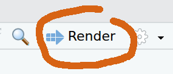
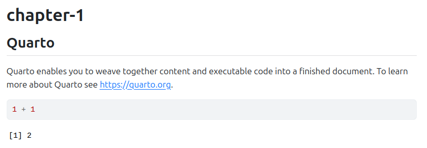
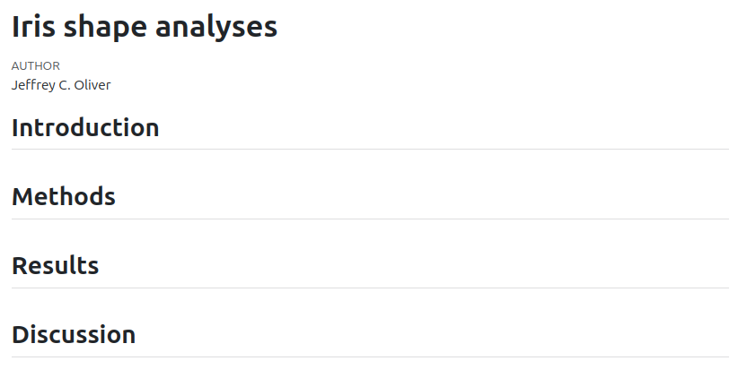

```{r library-check, echo = FALSE, results = "hide"}
#| output: false

libs <- c("knitr", "quarto")
libs_missing <- libs[!(libs %in% installed.packages()[, "Package"])]
if (length(libs_missing) > 0) {
  for (l in libs_missing) {
    install.packages(l)
  }
}
```

An introduction to using the `quarto` package in R to produce reproducible, 
dynamic reports. 

# TODO: Add link to knitr lesson?

#### Learning objectives

After this lesson, learners should be able to:

1. Install and use third-party packages for R
2. Explain the difference between code blocks and markdown text
3. Apply text formatting for headers and font styles
4. Include output from R code in a document

## Literate programming

What if there was a way to include text _and_ all the code we used for our 
analyses in a single document? What about a report that includes not only data
visualization, but the actual code used to produce those visualizations? With 
literate programming, we write text and code in a single document - this way, 
we can update reports and manuscripts with new data or corrections with minimal 
effort.

## Setup

### Install libraries

The R program has a bunch of tools that come with the initial installation, but 
we are going to use some add-ons for this lesson. In R, these "add-ons" are 
called packages, and we have to install them in order to use them on our 
machine. For this workshop, we will install two additional packages: knitr and 
quarto. For both, we will use the `install.packages()` function in R. In your 
Console of RStudio (usually the lower-left pane of RStudio), run:

```{r install-libraries, eval = FALSE}
install.packages("knitr")
install.packages("quarto")
```

At this point it would be useful to shut down RStudio and start it up again. We 
do this just so RStudio is aware of those two packages we just installed.

### Create a project

Next we need to setup our development environment. Open RStudio and create a 
new project via:

+ File > New Project...
+ Select 'New Directory'
+ For the Project Type select 'Quarto Project'
+ For Directory name, call it "chapter-1" (without the quotes)
+ For the subdirectory, select somewhere you will remember (like "My Documents" 
or "Desktop")

***

## Markdown syntax and "rendering"

When we create the file, we have an document called chapter-1.qmd open by 
default. This is what is known as a plain text document, which means it can be 
opened and edited in any text editor, like NotePad, TextEdit, nano, or for the 
truely sadistic, vm.

### Syntax

There are currently three parts to the file. At the very 
top is the YAML header:

```
---
title: "chapter-1"
---
```

Not a lot of information here, but this is the section you can use for setting 
document-level formatting and settings. We will not work too much in this space 
in this lesson.

Second, you see some text:

```
## Quarto

Quarto enables you to weave together content and executable code into a 
finished document. To learn more about Quarto see <https://quarto.org>.
```

This is what is known as a markdown 'chunk', as it is mostly text for human 
eyes. That is, there is not any real code in this section.

Finally, we see a small bit of R code in a gray rectangle:

    ```{r}`r ''`
    1+1
    ```

This is what is known as a code 'chunk', as it contains R code we want to run. 
There are a couple things to note about this chunk. First, it starts and ends 
with three backticks ("`"). The backtick key usually lives in the top left part 
of your keyboard, above the Tab key. *All* code chunks will start and end with 
three backticks. Second, we are specifying that the code chunk is written in 
the R programming language by adding a lower-case "r" inside of curly braces 
("`{r}`"). That may seem redundant, as we are working in RStudio, but the 
Quarto system is flexible enough to accommodate other programming languages, 
too, such as Python or Julia.

A reminder that everything we see is plain text. There is no special formatting 
(even though RStudio is helping with some coloring) in this file.

### Rendering

This plain text file can be thought of as a set of instructions. Some of the 
instructions just indicate text to print (like the part starting "Quarto 
enables you to..."), and other instructions are to run some code and print the 
output of that code. We can see this in action by "rendering" the document. 
This tells the computer to take those instructions and make a document. The 
three most common output formats of these documents are HTML (like a web page), 
PDF, and DOC a word processing format for programs like LibreOffice and 
Microsoft Word. For much of this lesson, we will be creating a HTML file as our 
output document. To create the document, press the "Render" button near the top 
of the pane with our .qmd file.



After a moment, a web browser should open, displaying the rendered document. It 
should look something like:



Looking at this page, we have:

1. The title of the document, "chapter-1", which comes from the YAML section;
2. The heading "Quarto". This is that little bit of text on the line that
started with two pound signs ("##");
3. The text describing what Quarto does;
4. The R code adding 1 + 1 shown in the gray box, and
5. The output resulting from our R code (the integer 2, in this case).

### Changing stuff and seeing what happens

You will note that there is some formatting stuff happening in our final 
document! The title and the first use of "Quarto" are larger font are probably 
the most notable. At this point, we are going to edit the document to reflect 
the structure of our desired output. Remember that we are writing the world's 
shortest scientific report, so let us update the title and add section headers. 

Go ahead and update the very top of the file so the YAML header has a more 
descriptive title ("Iris shape analyses") and on a new line, add your name as 
author:

```
---
title: "Iris Shape Analyses"
author: "Jeffrey C. Oliver"     <- Use YOUR name here, not mine :)
---
```

After the last set of three dashes (`---`), delete the remaining contents and 
add the four section headers of our paper (Introduction, Methods, Results, and 
Discussion):

```
## Introduction

## Methods

## Results

## Discussion
```

Go ahead and save the file, then press the "Render" button. The output should
look like this:



### Formatting fun

***

## [TOPIC TWO Code chunks]

Make a plot

Run some stats (hiding the output)

***

## [TOPIC THREE Taking code into text]

Stuff like putting r2 values in text

***

## [TOPIC FOUR Template files (doc)]

***

## Additional resources

+ [resource one](url-one)
+ [resource two](url-two)
+ A [PDF version](https://jcoliver.github.io/learn-r/lesson-name.pdf) of this lesson

***
