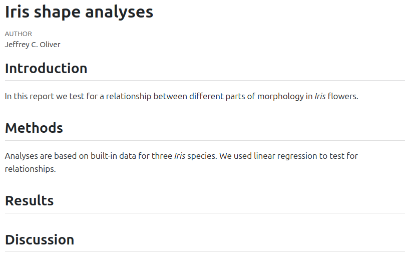
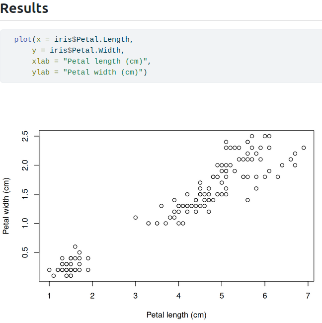

```{r library-check, echo = FALSE, results = "hide"}
#| output: false

libs <- c("knitr", "quarto")
libs_missing <- libs[!(libs %in% installed.packages()[, "Package"])]
if (length(libs_missing) > 0) {
  for (l in libs_missing) {
    install.packages(l)
  }
}
```

An introduction to using the `quarto` package in R to produce reproducible, 
dynamic reports. 

# TODO: Add link to knitr lesson?

#### Learning objectives

After this lesson, learners should be able to:

1. Install and use third-party packages for R
2. Explain the difference between code blocks and markdown text
3. Apply text formatting for headers and font styles
4. Include output from R code in a document

## Literate programming

What if there was a way to include text _and_ all the code we used for our 
analyses in a single document? What about a report that includes not only data
visualization, but the actual code used to produce those visualizations? With 
literate programming, we write text and code in a single document - this way, 
we can update reports and manuscripts with new data or corrections with minimal 
effort.

## Setup

### Install libraries

The R program has a bunch of tools that come with the initial installation, but 
we are going to use some add-ons for this lesson. In R, these "add-ons" are 
called packages, and we have to install them in order to use them on our 
machine. For this workshop, we will install two additional packages: knitr and 
quarto. For both, we will use the `install.packages()` function in R. In your 
Console of RStudio (usually the lower-left pane of RStudio), run:

```{r install-libraries, eval = FALSE}
install.packages("knitr")
install.packages("quarto")
```

At this point it would be useful to shut down RStudio and start it up again. We 
do this just so RStudio is aware of those two packages we just installed.

### Create a project

Next we need to setup our development environment. Open RStudio and create a 
new project via:

+ File > New Project...
+ Select 'New Directory'
+ For the Project Type select 'Quarto Project'
+ For Directory name, call it "chapter-1" (without the quotes)
+ For the subdirectory, select somewhere you will remember (like "My Documents" 
or "Desktop")

***

## Markdown syntax and "rendering"

When we create the file, we have an document called chapter-1.qmd open by 
default. This is what is known as a plain text document, which means it can be 
opened and edited in any text editor, like NotePad, TextEdit, nano, or for the 
truly sadistic, vm.

### Syntax

There are currently three parts to the file. At the very 
top is the YAML header:

```
---
title: "chapter-1"
---
```

Not a lot of information here, but this is the section you can use for setting 
document-level formatting and settings. We will not work too much in this space 
in this lesson.

Second, you see some text:

```
## Quarto

Quarto enables you to weave together content and executable code into a 
finished document. To learn more about Quarto see <https://quarto.org>.
```

This is what is known as a markdown 'chunk', as it is mostly text for human 
eyes. That is, there is not any real code in this section.

Finally, we see a small bit of R code in a gray rectangle:

    ```{r}`r ''`
    1+1
    ```

This is what is known as a code 'chunk', as it contains R code we want to run. 
There are a couple things to note about this chunk. First, it starts and ends 
with three backticks ("\`"). The backtick key usually lives in the top left part 
of your keyboard, above the Tab key. *All* code chunks will start and end with 
three backticks. Second, we are specifying that the code chunk is written in 
the R programming language by adding a lower-case "r" inside of curly braces 
("`{r}`"). That may seem redundant, as we are working in RStudio, but the 
Quarto system is flexible enough to accommodate other programming languages, 
too, such as Python or Julia.

A reminder that everything we see is plain text. There is no special formatting 
(even though RStudio is helping with some coloring) in this file.

### Rendering

This plain text file can be thought of as a set of instructions. Some of the 
instructions just indicate text to print (like the part starting "Quarto 
enables you to..."), and other instructions are to run some code and print the 
output of that code. We can see this in action by "rendering" the document. 
This tells the computer to take those instructions and make a document. The 
three most common output formats of these documents are HTML (like a web page), 
PDF, and DOC a word processing format for programs like LibreOffice and 
Microsoft Word. For much of this lesson, we will be creating a HTML file as our 
output document. To create the document, press the "Render" button near the top 
of the pane with our .qmd file.


After a moment, a web browser should open, displaying the rendered document. It 
should look something like:

> # chapter-1
> 
> ## Quarto
> 
> Quarto enables you to weave together content and executable code into a 
> finished document. To learn more about Quarto, see <https://quarto.org>.
> 
> ```{r}
> 1 + 1
> ```

<!--

-->

Looking at this page, we have:

1. The title of the document, "chapter-1", which comes from the YAML section;
2. The heading "Quarto". This is that little bit of text on the line that
started with two pound signs ("##");
3. The text describing what Quarto does;
4. The R code adding 1 + 1 shown in the gray box, and
5. The output resulting from our R code (the integer 2, in this case).

### Changing stuff and seeing what happens

You will note that there is some formatting stuff happening in our final 
document! The title and the first use of "Quarto" are larger font are probably 
the most notable. At this point, we are going to edit the document to reflect 
the structure of our desired output. Remember that we are writing the world's 
shortest scientific report, so let us update the title and add section headers. 

Go ahead and update the very top of the file so the YAML header has a more 
descriptive title ("Iris shape analyses") and on a new line, add your name as 
author:

```
---
title: "Iris Shape Analyses"
author: "Jeffrey C. Oliver"     <- Use YOUR name here, not mine :)
---
```

After the last set of three dashes (`---`), delete the remaining contents and 
add the four section headers of our paper (Introduction, Methods, Results, and 
Discussion):

```
## Introduction

## Methods

## Results

## Discussion
```

Go ahead and save the file, then press the "Render" button. The output should
look like this:

> # Iris shape analyses
> 
> AUTHOR  
> Jeffrey C. Oliver
> 
> ## Introduction
> 
> ## Methods
> 
> ## Results
> 
> ## Discussion

<!--

-->

### Formatting fun

To start, we will add a little information in the **Introduction** and 
**Methods** sections. For the introduction, we will add a sentence about what 
the document is about. Note that because we are using the scientific name for 
the flowers, we want to italicize the name. We can make text italic by adding 
underscores ("_") immediately before and after the text we want italicized (in 
this case, we add an underscore immediately before and immediately after the 
word "Iris").

```
## Introduction

In this report we test for a relationship between different parts of morphology 
in _Iris_ flowers.
```

Next we can add information about the data we will be using. In this case it is 
the `iris` dataset that is built into R. Add this to the Methods section:

```
## Methods

Analyses are based on built-in data for three _Iris_ species. We used linear 
regression to test for relationships.
```

Let us go ahead and save the file, then press the "Render" button to make sure 
the text was added as we expect. You should now have a report with more 
information (albeit minimal) in the **Introduction** and **Methods** sections:

> # Iris shape analyses
> 
> AUTHOR  
> Jeffrey C. Oliver
> 
> ## Introduction
> In this report we test for a relationship between different parts of 
> morphology in _Iris_ flowers.
> 
> ## Methods
> Analyses are based on built-in data for three _Iris_ species. We used linear 
> regression to test for relationships.
> 
> ## Results
> 
> ## Discussion

<!--

-->

Note that in both sections, the word "Iris" should be italicized. We can also 
see the difference between normal text and those section headers (Introduction,
Methods, Results, and Discussion). When we start a line with pound sign(s) 
("#") in a text block, it will format the text as a header. That is, it uses 
larger, bold font. If you are familiar with web development, the number of 
pound signs indicates header level: `#` = H1, `##` = H2, `###` = H3, and so on. 
Note this is very different behavior when starting a line in R with a pound 
sign, where `#` indicates a comment.

***

## Code chunks

And speaking of R code, we are now going to see the real power of these 
documents.

### Showing our work

For the next step, we will write a code chunk to create a plot of some of the 
data. Recall that we are interested in the measurements of some flower parts in
three species of _Iris_. For our purposes, we want to include a plot that has
measurements of petal length on the x (horizontal) axis and the measurements of 
petal width on the y (vertical) axis. To write an R code block, we use
triple-backticks (`` ``` ``) and braces ("`{r}`") to indicate the language (R 
in our case, but other languages such as python and bash can also be 
supported). Here we add code to indicate the start of the **Results** section, 
as well as a plot of the two variables:

    ## Results
    
    ```{r}`r ''`
    plot(x = iris$Petal.Length, 
        y = iris$Petal.Width,
        xlab = "Petal length (cm)",
        ylab = "Petal width (cm)")
    ```

When writing these code blocks, we need to explicitly tell R when to *stop* 
interpreting the text as R code. We do this with three more backticks 
(`` ``` ``) after the last line of code.

Once you have that code block written (don't forget the closing backticks!), 
save the file and press the "Render" button.

> ## Results
> 
> ```{r}
>     plot(x = iris$Petal.Length, 
>          y = iris$Petal.Width,
>          xlab = "Petal length (cm)",
>          ylab = "Petal width (cm)")
> ```

<!--

-->

### Hiding our work

In some cases, we may want to run some analyses, but keep the code restricted 
to our source file (the source file is the one we are working in right now). We 
might do this when the code is not necessary to include in our output, but the 
results are. In our case, we want to measure the correlation between the two 
flower measurements, petal length and petal width. We are really interested in 
showing the *r*^2^ value, but we do not need to show the code we 
used to find it (remember, the code *will* be in this source file, in case we 
need to update it). To hide the code of a code chunk, we will pass 
`echo = FALSE` in the first line of the code chunk, right after we tell it to 
use R as the programming language. So, after the code chunk that we used to 
make the plot, we can add another chunk, this one where we hide the source code 
from the output:

    ```{r, echo = FALSE}`r ''`
    # Our correlation code goes here
    ```

To run the correlation, we will use the `cor()` function in R, and assign that 
value to a variable we will call `r`. We will then take that value and square 
it to obtain the *r*^2^ value. Update this latest code chunk with:

    ```{r, echo = FALSE}`r ''`
    # Run correlation
    r <- cor(iris$Petal.Length, iris$Petal.Width)
    # Calculate r-squared
    r_squared <- r * r
    ```

And rendering the document produces...well, exactly what we had before. That 
is, we have a plot, but there isn't anything about the correlation in the 
output.

But this is OK!

***

## More fun in the text blocks

### Inline code

A lot of times, we want to perform some analyses or data wranging (or, more 
likely, both), and while the underlying code does not need to be included in 
our report, we do need to show the results. Here is where "inline code" comes 
in.

We can use a regular text block and make an "inline" call to R, in order to 
access the value and include it in our report. We use the term "inline" to mean 
exactly that: in the line of text where we want some result to appear, we add a 
little bit of R code to retrieve values stored in a variable.

For our purposes, we want to add a little bit of text about the correlation 
between petal length and petal width and include the *r*^2^ we calculated in 
the preceding code chunk. So, insert an empty line after the code chunk and add:

```{r, echo = FALSE}
# Run correlation
r <- cor(iris$Petal.Length, iris$Petal.Width)
# Calculate r-squared
r_squared <- r * r
```

<!-- Oh. My. God. I hate backticks so much right now. -->

```
Petal width and petal length were highly correlated (r^2^ = `r '\x60r r_squared\x60'`).
```

So, what is this doing? First, we are adding some old fashioned regular text 
(Starting with "Petal width and..."). In the parentheses we have "r\^2\^". 
Those carats ("^") surrounding the 2 indicate we want the number 2 to show up 
as a superscript. Following the equals sign, we have a *single* backtick, a 
lower case "r", a call to the *r*^2^ variable we created in the 
code chunk above (`r_squared`), and a closing single backtick. With inline 
calls to R, we can print out values stored in variables. After adding that 
line, saving the file, and rendering, you should have one more line at the end 
of your **Results** section:

> Petal width and petal length were highly correlated (r^2^ = `r r_squared`).

<!--

-->

The use of inline code is not limited to only reporting values stored in 
variables; we can also use R functions. For example. the *r*^2^ value shows too 
many digits (seven digits is excessive!). We can use the `round()` function in 
the inline call. In this case we will round the *r*^2^ value to two digits. 
Update the text in the **Results** section to:

```
Petal width and petal length were highly correlated (r^2^ = `r '\x60r round(r_squared, digits = 2)\x60'`).
```

Make sure you have both the opening and closing parentheses for the `round()` 
function, or the document will not render correctly. After updating that line, 
saving your file, and Rendering, your **Results** section should look like:

> ## Results
>
> Petal width and petal length were highly correlated (r^2^ = `r round(r_squared, digits = 2)`).

### Link formatting

Let's add one more thing to this report. Since these data were were collected 
by the botanist Edgar Anderson, let's provide a link to the Wikipedia page with 
information about the data set. So go back to the Materials & Methods section 
and update it with a link:

Change:

```
## Methods

Analyses are based on built-in data for three _Iris_ species. We used linear 
regression to test for relationships.
```

To:

```
## Methods

Analyses are based on data for three _Iris_ species collected by 
[Edgar Anderson](https://en.wikipedia.org/wiki/Iris_flower_data_set). We used 
linear regression to test for relationships.
```

Save and render, and you should see:

> ## Methods
> 
> Analyses are based on data for three _Iris_ species collected by 
> [Edgar Anderson](https://en.wikipedia.org/wiki/Iris_flower_data_set). We used 
> linear regression to test for relationships.

### Inserting images


***

## [TOPIC FOUR Template files (doc)]

***

## Additional resources

+ [resource one](url-one)
+ [Information on creating Word template documents](https://quarto.org/docs/output-formats/ms-word-templates.html)
+ A [PDF version](https://jcoliver.github.io/learn-r/020-quarto-docs.pdf) of this lesson

***
