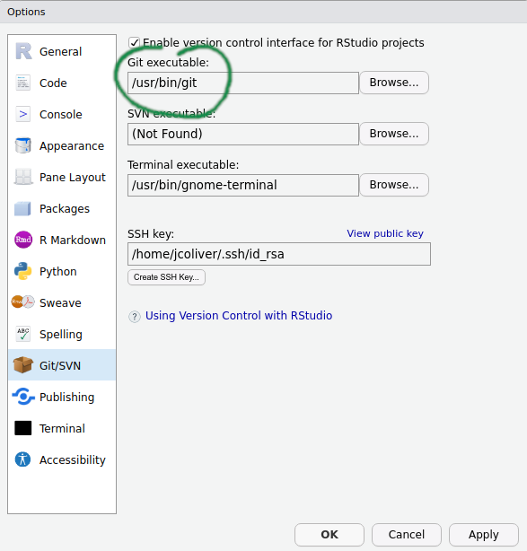
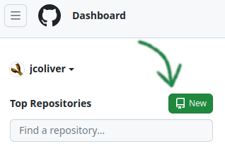
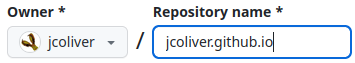

Setting up a webpage can be daunting, but the Quarto package makes it easier to 
create a professional-looking website from text files.

#### Learning objectives

1. Demonstrate how to start a Quarto website project
2. Add content and adjust theme of home page
3. Publish content online by sending files to GitHub
4. Add additional pages to the website

## [DESCRIPTION OR MOTIVATION; 2-4 sentences that would be used for an announcement]

***

## Getting started

We will be using the R package quarto to translate our files into web pages. 
Newer versions of RStudio will come with quarto installed, but we can go ahead 
and run installation of the package, just to be sure.

```{r install-quarto, eval = FALSE}
install.packages("quarto")
```

We will also be using GitHub to host our web pages, so you will need to sign up 
for a GitHub account if you do not have one already. You can do this at 
[github.com](https://github.com). If you have not had experience with GitHub 
and RStudio, I recommend you work through the 
[Git and GitHub lesson](https://jcoliver.github.io/learn-r/010-github.html). 
Most relevant for this lesson, you will need to have the Git software installed 
on your machine. To see if you have Git installed on your system, open RStudio 
and select Global Options from the Tools menu (Tools > Global Options...). In 
the dialog that opens, click the Git/SVN tab on the left-hand side of the 
pop-up window. Near the top of the pane, there is a field for the Git 
executable. If it says something like "/usr/bin/git" or "C:/Program Files/Git/" 
then you already have Git installed. Yay! 

{ width=50% }  

If instead it says "(Not Found)" in the Git executable field, then you will 
need to install Git before proceeding. See the [Git installation instructions](https://jcoliver.github.io/learn-r/010-github.html#getting-started) 
on the Git and GitHub lesson page for instructions and download links.

***

## Setting up the project

Now that you have all the software installed, we will start by setting up the 
folder on GitHub that will host all our files for the webpage. When we work 
with GitHub, each project will have a separate folder. These folders are called
"repositories" or "repos". For the rest of the lesson, I'll be using the terms 
repository and repo to refer to the GitHub location of our files. So to start, 
navigate to [github.com](https://github.com) and log into your account. Once 
logged in, you want to create a new repository - there should be a green button
with the word "New" or "New repository." Click that button!

{ width=50% }

In the "Create a new repository" page that opens, fill in the repository name 
field as "<username>.github.io" where you replace "<username>" with your GitHub
username. It will look a little funny, because your username is repeated, but 
this is how it should look:

{ width=50% }

Aside: If you have already created a repository with this name (GitHub will 
notify you of this with a warning like "The repository <username>.github.io 
already exists on this account"), you can just name your repository "mysite" 
for the purposes of this lesson.

Make sure to leave the "Public" radio button selected - no one (including 
yourself) will be able to see the website if the repository is Private. Leave 
the rest of the settings as their default values and press the green "Create 
repository" button near the bottom of the page.

+ New RStudio project
  + From existing GitHub repo?
    + Can do this from the console as long as Quarto is installed?
+ Add name and intro sentence
+ Send to GitHub

***

## Let's get fancy

+ Add a photo
+ Add a theme
+ Layout?
+ Send to GitHub

***

## More than a page

+ Add another page (need to come up with what this page actually is...)
+ Send to GitHub

***

## Add some bells and whistles

+ E-mail links
+ GitHub links
+ Picture shape?
+ Send to GitHub

***

## Additional resources

+ Sam Csik's [guide to getting started](https://ucsb-meds.github.io/creating-quarto-websites/) 
is another great place to get ideas. Sam's lesson was the inspiration for much 
of the materials here.
+ The [Official Quarto website documentation](https://quarto.org/docs/websites/)
+ A [PDF version](https://jcoliver.github.io/learn-r/0XX-quarto-web.pdf) of this lesson

# FIX lesson PDF link ^^^

***

<a href="index.html">Back to learn-r main page</a>
  
Questions?  e-mail me at <a href="mailto:jcoliver@arizona.edu">jcoliver@arizona.edu</a>.